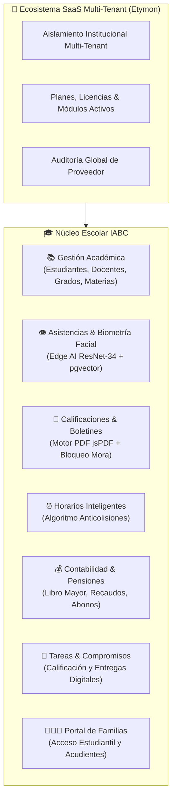

# 🏫 Plataforma Instituto ABC — Sistema de Gestión Escolar & Ecosistema SaaS Multi-Tenant

[](https://reactjs.org/)
[](https://vitejs.dev/)
[](https://www.typescriptlang.org/)
[](https://tailwindcss.com/)
[](https://supabase.com/)
[](https://vitest.dev/)
[](#)

Plataforma unificada de gestión académica, pedagógica, financiera, biométrica y comunitaria para instituciones educativas, construida sobre una arquitectura **SaaS Multi-Tenant** moderna y modular.

---

## 🌟 Visión General

La plataforma **Instituto ABC** centraliza y automatiza todo el ciclo de vida escolar, integrando desde el control de asistencias con **Biometría Facial Edge AI** y la emisión de **Boletines de Calificaciones en PDF**, hasta la gestión de **Pensiones y Contabilidad** con bloqueo rectoral y el **Portal de Familias**.



---

## 🚀 Módulos Principales de la Plataforma

| Módulo | Descripción Técnica & Capacidades |
| :--- | :--- |
| **👁️ Asistencias & Biometría Edge AI** | Registro diario de asistencia con detección y reconocimiento facial 100% en el navegador (Face-API / ResNet-34) respaldado por búsqueda vectorial (`pgvector` HNSW) y algoritmo anti-ambigüedad de Lowe. |
| **📝 Calificaciones & Boletines PDF** | Registro de notas por periodos académicos, notas parciales, evaluaciones de preescolar por dimensiones y generación instantánea de boletines oficiales en PDF vectorizado de alta fidelidad. |
| **💰 Contabilidad & Pensiones** | Control de cartera de pensiones mensuales, pagos masivos, asignación individual de tarifas, libro mayor de ingresos/egresos y control de expedición temporal de boletines con mora. |
| **⏰ Horarios Anticolisiones** | Diseñador visual de horarios por grado y docente con detección matemática de solapamientos en tiempo real y soporte para bloques de rutina institucional. |
| **📑 Tareas & Compromisos** | Asignación y retroalimentación digital de compromisos escolares con adjuntos, estados de entrega y fechas límite configurables. |
| **👨‍👩‍👧 Portal de Familias** | Acceso seguro para acudientes y estudiantes con visualización de calificaciones, horarios, tareas, estado de cuenta y notificaciones en tiempo real. |
| **🏢 Panel Proveedor (Etymon SaaS)** | Centro de control multi-institución con métricas KPI, gestión de suscripciones, límites de usuarios, activación de módulos y auditoría de eventos. |

---

## 🛠️ Stack Tecnológico

* **Frontend:** React 18 (SPA), TypeScript 5.5, Vite 5.
* **Estilos y Diseño:** Tailwind CSS, Radix UI Primitives, shadcn/ui, Lucide Icons.
* **Sistema de Diseño:** Tokens de color CSS en espacio HSL, tema Claro/Oscuro y Glassmorphism.
* **Gestión de Estado y Datos:** TanStack Query v5 (React Query) con caché optimista.
* **Backend y Base de Datos:** Supabase (PostgreSQL 15+ con `pgvector` y Row Level Security - RLS).
* **Inteligencia Artificial:** Face-API.js (TinyFaceDetector, FaceLandmark68Net, FaceRecognitionNet).
* **Motor de Documentos:** jsPDF + jspdf-autotable con renderizado modular y fuentes vectoriales.
* **Pruebas y Calidad:** Vitest (20 suites de pruebas unitarias y de integración, 89 tests).

---

## 📁 Estructura del Proyecto

El código sigue una arquitectura **Modular basada en Funcionalidades (Feature-Driven Architecture)** con separación estricta de responsabilidades (SRP) y una regla arquitectónica de **máximo 300 líneas por archivo**:

```
e:\iabc/
├── docs/                        # Documentación técnica, guías y manuales
│   ├── ARQUITECTURA_MODULAR.md  # Normas de modularidad y diseño limpio
│   ├── GUIA_DESARROLLO_Y_ESTANDARES.md # Estándares de CSS, a11y y testing
│   ├── MANUAL_SISTEMA_INTEGRAL.md # Manual técnico y operativo completo
│   ├── core_reconocimiento_facial.md # Deep dive de IA Biometría
│   └── README.md                # Índice de documentación
├── sql/                         # Esquemas de base de datos y migraciones
│   ├── migrations/              # Migraciones versionadas y seguras
│   └── manual/                  # Scripts de diagnóstico y validación
├── src/
│   ├── components/              # Componentes UI reutilizables y layout
│   │   ├── auth/                # Rutas protegidas y guardias de rol
│   │   └── ui/                  # Componentes base (shadcn/ui + Radix)
│   ├── contexts/                # AuthContext, ThemeContext, InstitutionContext
│   ├── features/                # Módulos de negocio modularizados
│   │   ├── asistencias/         # Contenedor y subcomponentes de asistencia
│   │   ├── calificaciones/      # Hook useCalificacionesLogic y subcomponentes
│   │   ├── contabilidad/        # Pensiones, Libro Mayor (tuitionConfig, ledger)
│   │   ├── horarios/            # Algoritmos anticolisión y grilla horaria
│   │   └── tareas/              # Formularios y listados de compromisos
│   ├── hooks/                   # Custom Hooks de React Query
│   │   ├── school/              # Fachadas y sub-hooks (accounting, teachers...)
│   │   └── useSchoolData.ts     # Fachada global retrocompatible
│   ├── lib/                     # Clientes Supabase, biometría y validaciones
│   ├── pages/                   # Vistas y enrutamiento de la plataforma
│   └── utils/                   # Motores PDF, formateadores y utilidades
├── GOBIERNO_DATOS_Y_OPERACION.md # Guía operativa y runbook de BD
├── SECURITY.md                  # Política de seguridad, RLS y privacidad
└── README.md                    # Este archivo
```

---

## ⚡ Instalación y Ejecución Local

### Prerrequisitos
* **Node.js:** Versión 20.x o superior.
* **npm:** Versión 10.x o superior.

### 1. Clonar el repositorio e instalar dependencias
```bash
git clone https://github.com/tu-organizacion/iabc.git
cd iabc
npm install
```

### 2. Configurar variables de entorno
Crea un archivo `.env.local` en la raíz del proyecto tomando como base `.env.example`:

```env
VITE_SUPABASE_URL=https://tu-proyecto.supabase.co
VITE_SUPABASE_PUBLISHABLE_KEY=tu_anon_key
VITE_SUPABASE_PROJECT_ID=tu_project_id
```

### 3. Ejecutar en modo desarrollo
```bash
npm run dev
```

---

## 🧪 Pruebas y Validación de Calidad

El proyecto incluye un robusto conjunto de pruebas unitarias y de integración que validan la lógica de negocio, RLS, biometría y cálculos matemáticos:

```bash
# Ejecutar suite de pruebas unitarias (Vitest)
npm run test

# Verificación estática de tipos TypeScript
npx tsc --noEmit

# Compilar bundle de producción
npm run build
```

> [!TIP]
> **Estado de Calidad:** 100% de los tests pasan exitosamente (**89/89 tests en 20 suites**), con **0 errores** de TypeScript y bundle de producción optimizado.

---

## 🔒 Seguridad y Privacidad

Para conocer en detalle las políticas de seguridad, el modelo de aislamiento multi-tenant mediante RLS, el tratamiento seguro de vectores biométricos y el protocolo de reporte de vulnerabilidades, consulta:
👉 **[SECURITY.md](file:///e:/iabc/SECURITY.md)**

---

## 📚 Documentación Adicional

* 📖 **[Manual Técnico y Operativo Integral](file:///e:/iabc/docs/MANUAL_SISTEMA_INTEGRAL.md)**
* 📐 **[Guía de Arquitectura Modular & Patrones](file:///e:/iabc/docs/ARQUITECTURA_MODULAR.md)**
* 🎨 **[Estándares de Desarrollo, UI & a11y](file:///e:/iabc/docs/GUIA_DESARROLLO_Y_ESTANDARES.md)**
* 🛡️ **[Gobierno de Datos, Base de Datos y Operación](file:///e:/iabc/GOBIERNO_DATOS_Y_OPERACION.md)**
* 👁️ **[Documentación del Core de Reconocimiento Facial](file:///e:/iabc/docs/core_reconocimiento_facial.md)**

---

© 2026 Instituto Pedagógico ABC. Todos los derechos reservados.
