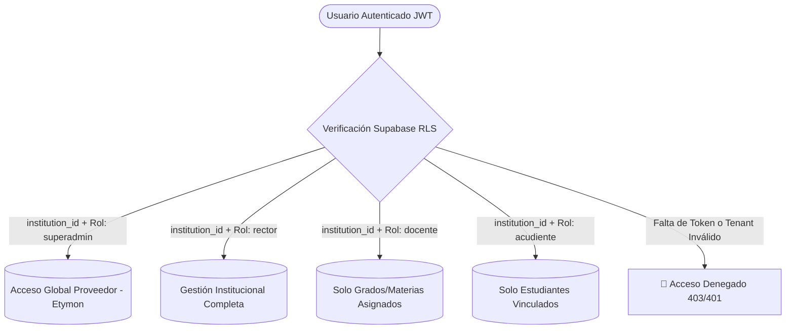
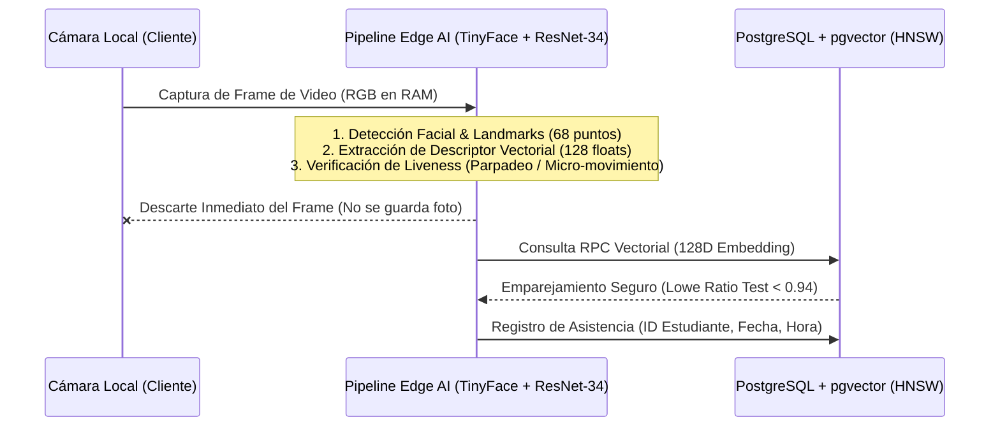

# 🛡️ Política de Seguridad & Modelo de Protección de Datos

**Plataforma de Gestión Escolar & Ecosistema SaaS Multi-Tenant**  
*Instituto Pedagógico ABC — Versión 2.0 (Producción)*  
*Última actualización: Septiembre 2026*

---

## 1. Declaración de Principios de Seguridad

La plataforma **Instituto ABC** procesa información crítica de carácter institucional, financiero, académico y biométrico. La seguridad de la información está diseñada bajo el principio de **Defensa en Profundidad (Defense-in-Depth)** y **Mínimo Privilegio (Principle of Least Privilege)**, garantizando:

1. **Aislamiento Multi-Tenant Absoluto:** Ninguna institución puede leer ni mutar información perteneciente a otra institución.
2. **Seguridad a Nivel de Base de Datos (Row Level Security - RLS):** Las reglas de acceso están impuestas y auditadas directamente en el motor PostgreSQL, imposibilitando la fuga de datos aun ante eventuales fallos de lógica en el cliente.
3. **Privacidad Biométrica por Diseño (Edge AI Privacy):** Las imágenes faciales de estudiantes y docentes son procesadas localmente en memoria volátil; en base de datos únicamente se persisten descriptores matemáticos (vectores 128D) cifrados, nunca fotografías sin procesar.
4. **Trazabilidad e Inmutabilidad Financiera:** Los registros contables y de recaudos cuentan con auditoría forense (`audit_logs`) y validación de permisos rectorales.

---

## 2. Modelo de Autenticación y Control de Acceso (RBAC & RLS)

### 2.1. Matriz de Roles y Alcance de Privilegios

| Rol | Alcance de Lectura | Alcance de Escritura | Políticas Clave RLS |
| :--- | :--- | :--- | :--- |
| **`superadmin`** (Etymon) | Global (todas las instituciones, suscripciones, KPIs). | Gestión de licencias, módulos, auditoría global y soporte. | `provider_audit_select`, `institution_manage` |
| **`rector`** (Administrador) | Todo el contenido de su institución (`institution_id`). | Control total académico, financiero, usuarios y asistencias. | `rector_full_access`, `institution_isolation` |
| **`docente`** (Profesor) | Estudiantes de sus grados asignados, horarios y materias asignadas. | Calificaciones y asistencias de sus clases activas. | `teacher_assigned_grades_only`, `teacher_attendance_rw` |
| **`acudiente`** (Familias) | Calificaciones, horarios, tareas y pagos **únicamente de sus hijos**. | Envío de comprobantes de pago y actualización de contacto. | `guardian_student_bind_only`, `guardian_read_grades` |

> [!IMPORTANT]
> **Aislamiento Multi-Tenant Obligatorio:** Toda tabla operativa de la base de datos incluye la columna `institution_id` indexada, protegida por políticas RLS activas que impiden cruces de información entre colegios.

---

## 3. Protección y Privacidad de Datos Biométricos

El subsistema de reconocimiento facial implementa salvaguardas avanzadas para la protección de datos sensibles conforme a normativas de protección de datos personales de menores de edad:

### Salvaguardas Biométricas Implementadas:
1. **Sin Almacenamiento de Fotografías:** El sistema **nunca almacena fotografías** de los rostros en el servidor ni en buckets públicos. Solo se guardan representaciones matemáticas unidireccionales (vectores flotantes normalizados de 128 dimensiones).
2. **Defensa contra Ambigüedad (Lowe's Margin Ratio Test):** Si la distancia euclidiana entre el primer y segundo candidato más cercano supera el umbral de seguridad de Lowe ($> 0.94$), el sistema rechaza el match por ambigüedad para evitar falsos positivos.
3. **Detección de Vida (Liveness Detection):** Detección de parpadeo y variabilidad de landmarks para prevenir ataques de presentación por fotografías impresas o pantallas digitales (Anti-Spoofing).

---

## 4. Seguridad en Transacciones Financieras y Pensiones

1. **Inmutabilidad del Libro Mayor:** Las transacciones registradas en `financial_transactions` y los pagos de `student_tuition_payments` cuentan con identificadores únicos y auditoría de usuario emisor.
2. **Bloqueo Rectoral de Boletines con Mora:** La plataforma restringe la generación y descarga de boletines a estudiantes con cuotas vencidas, a menos que exista un permiso temporal explícito otorgado por el Rector (`temporary_report_card_access`).
3. **Abonos y Conciliación:** El motor de base de datos valida matemáticamente los montos acumulados antes de actualizar estados de cuenta.

---

## 5. Reporte de Vulnerabilidades y Divulgación Responsable

Agradecemos y valoramos el trabajo de los investigadores de seguridad y la comunidad para mantener nuestra plataforma segura.

### 5.1. Cómo Reportar una Vulnerabilidad
Si descubres una posible vulnerabilidad de seguridad en esta plataforma:

1. **NO divulgues públicamente el problema** ni lo expongas en issues o foros abiertos.
2. Envía un reporte detallado al equipo de seguridad:
   * **Correo de Seguridad:** `seguridad@etymon.co` / `rectoria@institutopedagogicoabc.edu.co`
   * **Asunto:** `[Seguridad IABC] Reporte de Vulnerabilidad: <Descripción Breve>`
3. **Información requerida en el reporte:**
   * Descripción clara de la vulnerabilidad y su impacto potencial.
   * Pasos reproducibles detallados (código de prueba de concepto o capturas si aplica).
   * Módulo o endpoint afectado.
   * Tu nombre o alias para los créditos en las notas de la versión (opcional).

### 5.2. Tiempos de Respuesta y Niveles de Servicio (SLA)

| Severidad | Primer Reconocimiento | Plan de Mitigación / Parche |
| :--- | :--- | :--- |
| **Crítica** (Fuga RLS, Bypass Auth) | `< 24 horas` | `< 48 horas` |
| **Alta** (Elevación de privilegios) | `< 48 horas` | `< 5 días hábiles` |
| **Media / Baja** (Mejoras defensivas) | `< 5 días hábiles` | Próximo ciclo de release |

---

## 6. Versiones Soportadas

| Versión | Soporte de Parches de Seguridad | Estado |
| :--- | :--- | :--- |
| **2.0.x (Actual)** | ✅ Soportada activamente | Producción |
| **1.x.x (Legacy)** | ❌ No soportada | Obsoleta (Migrada) |
