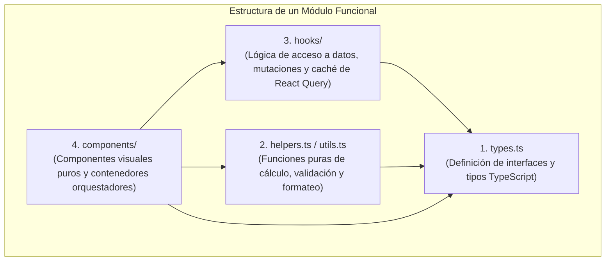

# 📐 Guía de Arquitectura Modular & Patrones de Diseño

**Plataforma Instituto ABC**  
*Estándar de Desarrollo Limpio y Prevención de Monolitos*

---

## 1. Principio Fundamental: Límite de 300 Líneas por Archivo

Para garantizar que el código sea mantenible, testeable y fácilmente comprensible por cualquier desarrollador o auditor, **ningún archivo de componente, hook o utilidad debe superar las 300 líneas de código**.

> [!IMPORTANT]
> Si un archivo supera las 300 líneas, debe ser descompuesto en submódulos especializados dentro de una subcarpeta temática dedicada (ej. `src/features/<modulo>/components/<subcarpeta>/` o `src/hooks/school/<modulo>/`).

---

## 2. Separación Estricta de Responsabilidades (SRP)

Cada módulo funcional se divide en cuatro capas claramente diferenciadas:



1. **Tipos e Interfaces (`types.ts`):** Modelos de datos puros sin lógica ni efectos secundarios.
2. **Cálculo y Formateo Puro (`helpers.ts`):** Funciones sin estado, 100% testeables de forma unitaria (ej. validaciones de fechas, cálculos de promedios, formateadores de moneda).
3. **Acceso a Datos y Mutaciones (`hooks/`):** Custom Hooks encapsulando React Query (`useQuery`, `useMutation`), gestión de caché e invalidación.
4. **Vistas de Presentación (`components/`):** Componentes visuales desacoplados que reciben props explícitas y emiten callbacks.

---

## 3. Patrón de Fachada Retrocompatible (*Zero Breaking Changes*)

Al refactorizar o dividir módulos grandes, **el archivo original se preserva como una fachada (Barrel / Facade)** que re-exporta los nuevos sub-elementos. Esto garantiza que ninguna importación existente en el resto del proyecto se rompa.

### Ejemplo Real del Proyecto: `useAccounting.ts`

```typescript
// src/hooks/school/useAccounting.ts (Fachada de 8 líneas)
export * from "./accounting/useTuitionHooks";
export * from "./accounting/useLedgerHooks";
export * from "./accounting/useInventoryHooks";
```

---

## 4. Mapa de Módulos Refactorizados

A continuación se detalla cómo están estructurados los 5 módulos principales de la plataforma tras la modularización:

### 4.1. Módulo Asistencias (`src/features/asistencias/`)
* **Orquestador:** [AsistenciasContainer.tsx](file:///e:/iabc/src/features/asistencias/components/AsistenciasContainer.tsx) (300 líneas).
* **Subcomponentes:**
  * `AttendanceFilterHeader.tsx` (128 líneas): Selector de fecha, docente, grado y materia con badges informativos.
  * `AttendanceSummaryBadges.tsx` (44 líneas): Contadores en tiempo real (Presentes, Ausentes, Justificadas, Sin Marcar).
  * `AttendanceActionButtons.tsx` (84 líneas): Botón de escáner facial, marcar todos presentes y guardar asistencia.
  * `AttendanceStudentTable.tsx` (194 líneas): Tabla de escritorio y tarjetas móviles para registro individual.

### 4.2. Módulo Calificaciones (`src/features/calificaciones/` & `src/pages/`)
* **Orquestador:** [Calificaciones.tsx](file:///e:/iabc/src/pages/Calificaciones.tsx) (135 líneas).
* **Lógica Encapsulada:** [useCalificacionesLogic.ts](file:///e:/iabc/src/features/calificaciones/hooks/useCalificacionesLogic.ts) (268 líneas): Filtros, cálculos de promedio, diálogos y descargas PDF.
* **Subcomponentes:**
  * `CalificacionesHeaderActions.tsx` (68 líneas): Botones de edición rápida y exportación de boletines.
  * `CalificacionesStatusAlerts.tsx` (76 líneas): Alertas de periodos en solo lectura y errores.

### 4.3. Módulo Contabilidad - Pensiones (`src/features/contabilidad/`)
* **Orquestador:** [TuitionConfigSection.tsx](file:///e:/iabc/src/features/contabilidad/components/TuitionConfigSection.tsx) (277 líneas).
* **Subcomponentes (`tuitionConfig/`):**
  * `TuitionTemporaryReportCardBanner.tsx` (49 líneas): Banner de permiso temporal de boletines con mora.
  * `TuitionQuickPaymentForm.tsx` (165 líneas): Formulario de registro de abonos y pagos rápidos.
  * `TuitionBulkAssignForm.tsx` (92 líneas): Asignación masiva de tarifas por año lectivo.
  * `TuitionIndividualProfileForm.tsx` (108 líneas): Ajuste individual de tarifa y rango de meses.

### 4.4. Módulo Contabilidad - Libro Mayor (`src/features/contabilidad/`)
* **Orquestador:** [LedgerSection.tsx](file:///e:/iabc/src/features/contabilidad/components/LedgerSection.tsx) (130 líneas).
* **Subcomponentes (`ledger/`):**
  * `LedgerCreateTransactionSheet.tsx` (162 líneas): Panel deslizable para nuevos ingresos/egresos con búsqueda de docentes e items.
  * `LedgerMovementCard.tsx` (141 líneas): Tarjeta reutilizable para listas de ingresos/egresos con exportación Excel/PDF y eliminación con confirmación.

### 4.5. Hooks de Contabilidad (`src/hooks/school/`)
* **Fachada:** [useAccounting.ts](file:///e:/iabc/src/hooks/school/useAccounting.ts) (8 líneas).
* **Sub-Hooks (`accounting/`):**
  * `useTuitionHooks.ts` (225 líneas): Perfiles de pensión, pagos, estados mensuales y notificaciones a acudientes.
  * `useLedgerHooks.ts` (102 líneas): Libro mayor y transacciones financieras.
  * `useInventoryHooks.ts` (116 líneas): Inventario escolar, consulta de estudiantes y profesores contables.

---

## 5. Reglas para Nuevos Desarrollos

> [!TIP]
> Antes de crear un nuevo componente o hook:
> 1. Crea la interfaz en `types.ts`.
> 2. Separa toda función matemática o de formateo en `helpers.ts` con su respectivo test unitario (`helpers.test.ts`).
> 3. Si el componente visual supera las 200 líneas, descompónlo inmediatamente en piezas atómicas (botones de acción, tablas, formularios, modales).
