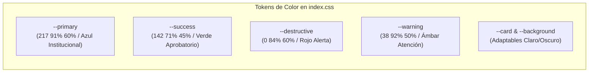
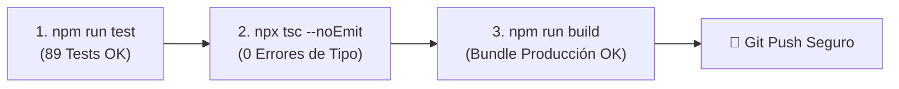

# 🎨 Guía de Desarrollo, Estándares UI y Pruebas

**Plataforma Instituto ABC**  
*Guía de Estilo, Sistema de Diseño y Protocolos de Calidad*

---

## 1. Sistema de Diseño & Tokens de Color (HSL)

La plataforma utiliza un sistema de diseño basado en variables CSS en espacio de color **HSL** (`src/index.css`), garantizando soporte nativo para **Modo Claro / Modo Oscuro** y efectos de **Glassmorphism**.

### 1.1. Paleta de Tokens Centrales



### 1.2. Reglas de Estilizado
* **Uso estricto de Tailwind CSS:** Aplicar clases de utilidad de Tailwind en lugar de CSS manual inline.
* **Sin Colores Genéricos Hardcodeados:** Usar siempre tokens semánticos: `text-primary`, `bg-muted`, `border-border`, `text-destructive`, `text-success`.
* **Efectos Glassmorphism:** Utilizar `backdrop-blur-md bg-card/80 border-border/50` para tarjetas flotantes y paneles deslizables.

---

## 2. Estándares de Accesibilidad (a11y)

Conforme a las pautas de accesibilidad web (WCAG 2.1 AA):

1. **Etiquetas en Acciones Iconográficas:** Todo botón que contenga únicamente un ícono (ej. `<Button variant="ghost"><Trash2 /></Button>`) **debe incluir obligatoriamente un atributo `aria-label`** descriptivo (ej. `aria-label="Eliminar movimiento contable..."`).
2. **Asociación de Formularios:** Todo campo de entrada (`<Input>`, `<Select>`, `<Textarea>`) debe estar precedido o envuelto por un elemento `<Label>`.
3. **Manejo del Foco:** Los diálogos (`<Dialog>`, `<Sheet>`, `<AlertDialog>`) deben atrapar el foco mientras están abiertos y restaurarlo al elemento disparador al cerrarse.

---

## 3. Estándar de Pruebas Unitarias e Integración (Vitest)

La plataforma cuenta con una suite completa de pruebas ejecutadas con **Vitest**:

```bash
# Ejecutar todas las pruebas
npm run test

# Ejecutar pruebas en modo observador (watch)
npm run test -- --watch
```

### 3.1. Estructura de Tests Recomendada
* Ubicar las pruebas unitarias puras junto al archivo de helpers: ej. `helpers.test.ts` junto a `helpers.ts`.
* Ubicar pruebas de integración de hooks o RLS en `src/hooks/school/__tests__/`.
* Usar nombres descriptivos en español que expliquen el contrato funcional esperado:

```typescript
describe("Cálculos de Asistencia y Resumen", () => {
  it("calcula correctamente el porcentaje de asistencia excluyendo faltas justificadas", () => {
    // Arrange, Act, Assert
  });
});
```

---

## 4. Flujo de Trabajo y Verificación Pre-Push

Antes de hacer `git push` o enviar cambios a revisión, es mandatorio ejecutar la secuencia de verificación local:



> [!TIP]
> Si cualquiera de los 3 pasos falla, el código no está listo para ser desplegado a producción.
