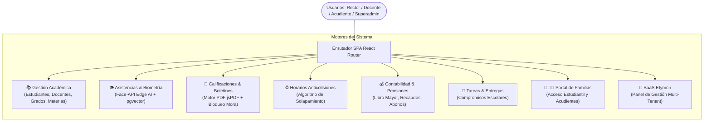

# 📖 Manual Integral del Sistema y Arquitectura

**Plataforma de Gestión Escolar & Ecosistema SaaS Multi-Tenant**  
*Instituto Pedagógico ABC — Versión 2.0 (Producción)*

---

## 1. Visión General del Ecosistema

La plataforma **Instituto ABC** es un sistema modular compuesto por 8 motores operativos:

---

## 2. Detalle de Motores Funcionales

### 2.1. Gestión Académica
* **Estudiantes:** Registro con documento, acudientes vinculados, estado activo/inactivo y foto de perfil.
* **Docentes:** Asignación granular de grados (`teacher_grade_assignments`) y materias (`teacher_subjects`).
* **Grados y Materias:** Estructura jerárquica con áreas troncales y sub-asignaturas hijas (`parent_id`).

### 2.2. Asistencias y Biometría Facial Edge AI
* **Detección Local:** Uso de redes neuronales convolucionales ligeras (`TinyFaceDetector`) en el navegador.
* **Vectorización:** Extracción de embeddings faciales de 128 dimensiones con `ResNet-34`.
* **Emparejamiento:** Búsqueda vectorial HNSW en PostgreSQL y filtro de ambigüedad de Lowe ($< 0.94$).
* **Protección de Datos:** Cero almacenamiento de imágenes de rostros en disco o servidores cloud.

### 2.3. Calificaciones y Motor de Boletines PDF
* **Periodos Académicos:** Control de apertura/cierre de periodos (periodos cerrados en modo solo lectura).
* **Preescolar:** Evaluaciones cualitativas por dimensiones de desarrollo formativo.
* **Primaria / Secundaria:** Escala numérica con conversor automático de desempeño (Superior, Alto, Básico, Bajo).
* **Generación de Boletines:** Renderizado vectorial en tiempo real mediante `jsPDF` y `jspdf-autotable`.

### 2.4. Horarios y Algoritmo Anticolisiones
* Grilla interactiva de Lunes a Viernes con bloques de tiempo configurables.
* Detección matemática en tiempo real para evitar que un docente o grado sea asignado dos veces a la misma hora.
* Soporte para bloques de rutina institucional (ej. Descanso, Formación, Almuerzo).

### 2.5. Contabilidad, Pensiones y Recaudos
* **Perfiles de Pensión:** Asignación masiva por año lectivo o individual con tarifas personalizadas.
* **Abonos y Pagos Rápidos:** Registro de recaudos mensuales con recibos digitales.
* **Libro Mayor:** Clasificación de ingresos y egresos operativos, nómina docente y compras de inventario.
* **Bloqueo Rectoral:** Restricción de descarga de boletines a estudiantes en mora, con permiso temporal configurable.

### 2.6. Portal de Familias
* Acceso seguro para padres y estudiantes mediante credenciales autogeneradas.
* Visualización en tiempo real de calificaciones parciales, boletines, tareas y horarios.
* Consulta de estado de cuenta y notificaciones institucionales.

### 2.7. SaaS Multi-Tenant Etymon
* Aislamiento por `institution_id` en todas las tablas mediante Row Level Security (RLS).
* Panel de administración central para gestión de planes, cuotas de almacenamiento y monitoreo de salud.
