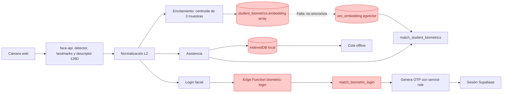
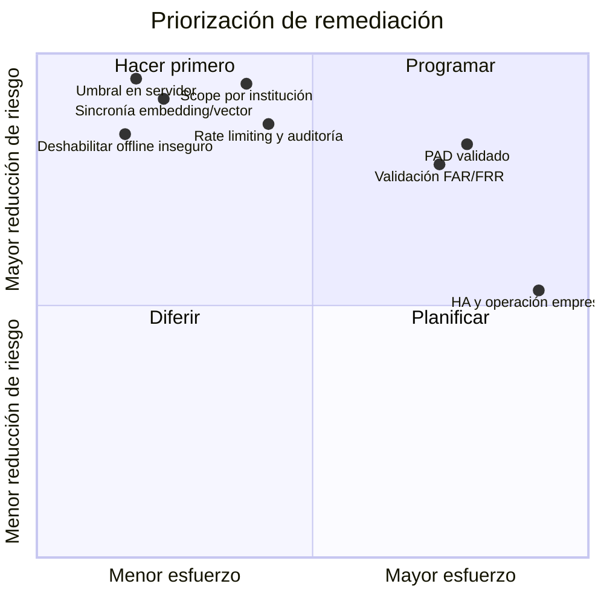
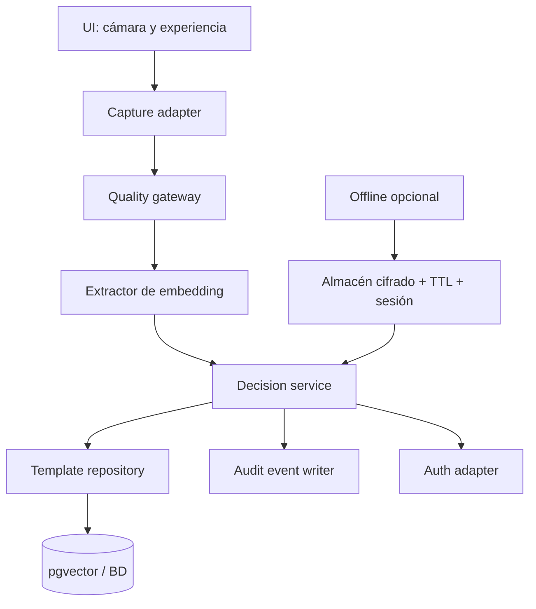
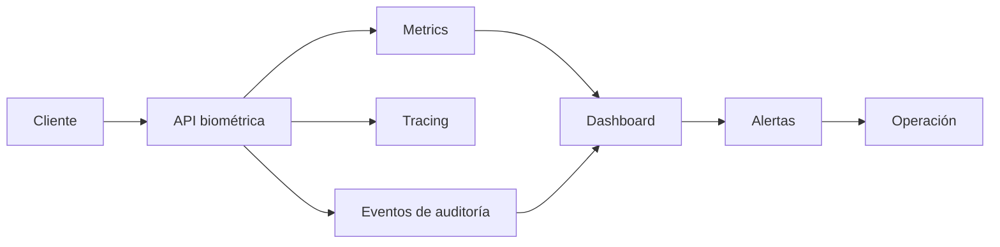
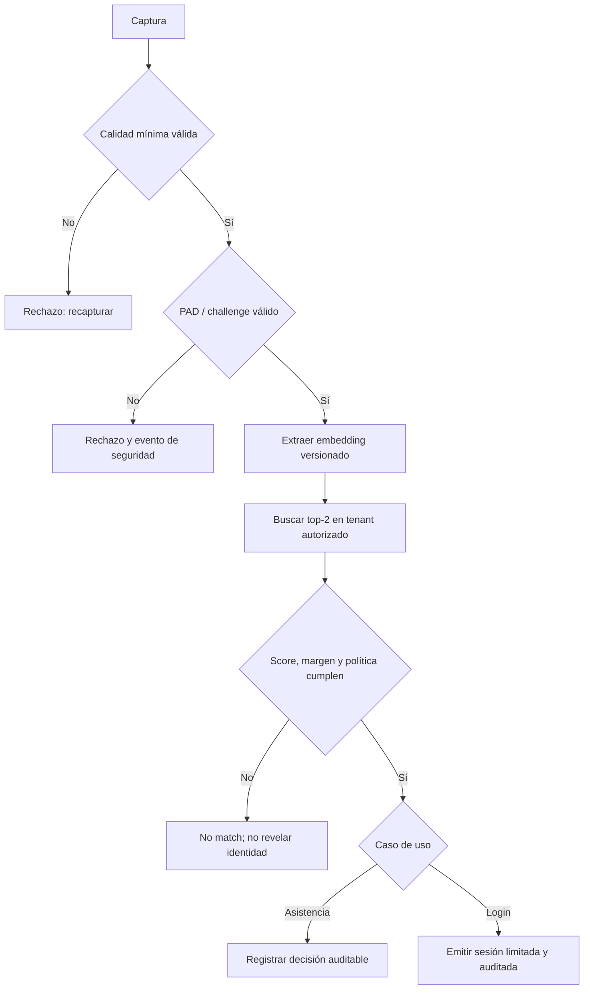

# Plan de evolución y estado real del Core Biométrico

> **Estado:** propuesta derivada de auditoría estática del repositorio, 12 de agosto de 2026.  
> **Alcance:** reconocimiento facial para asistencia y autenticación. No se modificó el Core para producir este documento.

## Decisión ejecutiva

El Core debe tratarse como un **MVP no apto para producción biométrica**. La prioridad no es añadir funcionalidades: es cerrar los fallos de autenticación, aislamiento institucional, integridad de embeddings y evidencia de liveness. Hasta completar la Fase 1, se recomienda mantener el login facial deshabilitado y no usar una asistencia facial como prueba de identidad de alto impacto.

## 1. Mapa del estado actual



### Brechas entre documentación y comportamiento ejecutado

| Promesa documentada | Comportamiento verificable en código |
|---|---|
| CLAHE, blur, alineación y PAD en el pipeline | `extractEmbeddingFromVideo` obtiene el descriptor directamente y devuelve indicadores de calidad fijos; asistencia y enrolamiento no aplican esas puertas de calidad. |
| Umbral de login >= 0.90 | El UI envía `0.88`; la Edge Function acepta un threshold proporcionado por el cliente. |
| Cache offline cifrada | IndexedDB almacena los embeddings en claro, sin TTL ni borrado al cerrar sesión. |
| Búsqueda vectorial para estudiantes | El enrolamiento escribe `embedding`; la RPC filtra por `vec_embedding`, sin trigger de sincronización. |

## 2. Riesgos y prioridad



| ID | Hallazgo | Severidad | Resultado buscado | Fase |
|---|---|---|---|---|
| H-01 | Threshold de autenticación manipulable por el cliente | Crítico | Política de decisión sólo del servidor | 1 |
| H-02 | Login vectorial sin filtro por institución | Crítico | Aislamiento estricto multi-tenant | 1 |
| H-03 | `embedding` y `vec_embedding` no se sincronizan | Crítico | Un único template canónico y búsqueda consistente | 1 |
| H-04 | Liveness declarado sin evidencia en asistencia/offline | Alto | Integridad verificable de asistencia | 1 |
| H-05 | Embeddings offline en claro y sin expiración | Alto | Retirar o proteger la modalidad offline | 1–2 |
| H-06 | Sin rate limit, lockout ni registro de intentos | Alto | Contención de abuso y trazabilidad | 2 |
| H-07 | PAD heurístico no validado | Alto | Defensa evaluada contra foto, pantalla y vídeo | 3 |
| H-08 | Sin FAR/FRR/EER ni calibración | Alto | Umbrales defendibles por caso de uso | 3 |
| H-09 | Sin observabilidad biométrica | Medio | Operación medible y alertable | 4 |
| H-10 | Acoplamiento de visión, persistencia y matching | Medio | Core sustituible y testeable | 2 |

## 3. Plan por fases

### Fase 0 — Contención inmediata

**Objetivo:** evitar que una debilidad conocida afecte cuentas o registros reales mientras se corrige el Core.

| Tarea | Responsable sugerido | Criterio de salida |
|---|---|---|
| Deshabilitar el login facial en producción o protegerlo tras feature flag administrativa | Backend / Seguridad | Ninguna Edge Function puede emitir un OTP por biometría hasta que H-01 y H-02 estén cerrados. |
| Marcar asistencia facial como auxiliar; no como único justificante | Producto / Operaciones | Flujo manual disponible y comunicación operativa. |
| Pausar enrolamientos nuevos de estudiantes si el vector pgvector no está sincronizado | Backend | No se acumulan templates imposibles de buscar remotamente. |
| Inventariar embeddings existentes, dispositivos cacheados y acceso a BD | Seguridad / DPO | Inventario firmado y plan de borrado o migración. |

**Dependencias:** ninguna.  
**Impacto:** reduce exposición inmediata; no resuelve el Core.

### Fase 1 — Correcciones críticas de seguridad e integridad

**Objetivo:** garantizar que el servidor, no el cliente, decide; y que los datos usados para buscar sean íntegros y estén aislados.

```mermaid
sequenceDiagram
    actor U as Usuario
    participant C as Cliente
    participant E as API biométrica
    participant P as Política servidor
    participant D as Base aislada por institución
    U->>C: Captura facial
    C->>E: embedding + prueba de sesión/contexto
    E->>P: valida dimensión, finitud, rate limit y política fija
    P->>D: busca sólo en la institución autorizada
    D-->>E: top-2 candidatos y metadatos de versión
    E->>P: evalúa threshold y margen en servidor
    P-->>C: decisión mínima; nunca template ni OTP reutilizable
```

1. **Fijar política de autenticación en servidor.** Eliminar `match_threshold` del contrato público de `biometric-login`; validar 128 valores numéricos finitos, normalizar en servidor o verificar su norma, y usar configuración versionada sólo de backend. Añadir comparación top-2/margen también en servidor.
2. **Aislar cada operación por institución.** Hacer `institution_id` obligatorio en templates, derivarlo de una sesión o contexto firmado —nunca confiar en un ID enviado por cliente— e imponerlo en RLS y en ambas RPC. Revisar también usuarios que pertenecen a más de una institución.
3. **Eliminar dualidad inconsistente de templates.** Preferido: conservar únicamente `vec_embedding vector(128)` como columna canónica. Alternativa temporal: trigger `BEFORE INSERT OR UPDATE` que valide y sincronice ambas columnas. Migrar y verificar cada fila existente antes de retirar la columna antigua.
4. **Corregir la integridad de asistencia.** El resultado facial debe incluir: `decision_id`, método, versión de política/modelo, score, liveness verificado y contexto de clase. No permitir que offline escriba `liveness_verified=true` sin prueba. La cola debe ser idempotente y contener las claves obligatorias de la asistencia.
5. **Tests de bloqueo.** Casos negativos: threshold cliente ignorado, tenant A no encuentra tenant B, template insertado se busca, vector inválido rechazado, y asistencia offline no puede afirmar liveness.

**Prioridad:** máxima.  
**Dependencias:** migraciones SQL revisadas y una decisión de producto sobre mantener login facial.  
**Resultado esperado:** no existe bypass conocido de umbral, fuga interinstitucional ni desalineación de template.

### Fase 2 — Robustecimiento arquitectónico y privacidad

**Objetivo:** hacer el Core reemplazable, auditable y seguro en los límites cliente/servidor.



1. Dividir `useBiometrics.ts` en adaptador del modelo, evaluación de calidad, matcher, repositorio Supabase y servicios de decisión. Mantener la UI sin reglas de seguridad.
2. Generar de nuevo tipos de Supabase e impedir casts `unknown` para tablas biométricas.
3. Implementar rate limit por IP, dispositivo, institución y cuenta; backoff, límites diarios y alertas de fuerza bruta.
4. Añadir auditoría append-only: enrolamiento, actualización, acceso, matching, rechazo, borrado y fallo de sincronización. Nunca registrar embeddings ni frames.
5. Definir retención, consentimiento, revocación, re-enrolamiento y borrado. Una plantilla debe portar `template_id`, `model_version`, `policy_version`, `quality_summary`, `created_at`, `expires_at` y `revoked_at`.
6. Retirar offline inicialmente. Si se conserva, usar cifrado WebCrypto con clave no persistente ligada a una sesión autorizada, TTL corto, borrado remoto/local y limitación por curso/dispositivo.
7. Fijar versión/hash de modelos distribuidos; eliminar fallback CDN no versionado o verificar su integridad.

**Prioridad:** alta.  
**Dependencias:** Fase 1 cerrada; definición legal/operativa de privacidad.  
**Resultado esperado:** componentes testeables, datos minimizados y operación controlable.

### Fase 3 — Validación biométrica y PAD

**Objetivo:** demostrar, con datos independientes, que la solución alcanza un riesgo aceptable para cada caso de uso.

| Línea de trabajo | Entregable |
|---|---|
| Protocolo de datos | Consentimiento, dataset representativo, separación por persona/familia/dispositivo e identidad de evaluador. |
| Verificación 1:1 | ROC/DET, FAR, FRR, EER, intervalos de confianza y threshold por nivel de riesgo. |
| Identificación 1:N | CMC, Rank-1/Rank-N, tasa de no identificación y efecto del tamaño de galería. |
| Calidad | Rechazo por iluminación, blur, pose, oclusión, cámara y distancia; no inventar un score sin validarlo. |
| Equidad | Métricas estratificadas por grupos pertinentes y análisis de diferencias. |
| PAD | Ensayos contra foto impresa, pantalla, replay de vídeo, cámara virtual y deepfake. |

No usar la heurística Moiré como única barrera de autenticación. Para login se requiere un mecanismo PAD evaluado más challenge-response activo y fallback seguro. Los thresholds de asistencia y autenticación deben ser independientes; autenticación exige el estándar más estricto.

**Prioridad:** alta antes de reactivar login facial.  
**Dependencias:** telemetría y trazabilidad de Fase 2.  
**Resultado esperado:** decisión explícita de aceptar, restringir o descartar cada caso de uso basada en mediciones.

### Fase 4 — Producción operable

**Objetivo:** asegurar rendimiento, resiliencia y detección temprana de degradación.



Medir por institución, versión y dispositivo: p50/p95/p99 de detección, extracción y matching; cold start de modelos; CPU/memoria; score/margen; rechazos; errores PAD; fallos de cola; tasa de enrolamiento/re-enrolamiento; y anomalías de distribución. Establecer SLO, alertas y runbooks.

Realizar pruebas de carga con planes de consulta reales (`EXPLAIN ANALYZE`), pruebas de concurrencia y restauración. Confirmar el comportamiento de HNSW bajo filtros por institución/curso: no asumir complejidad o latencia por el tipo de índice.

**Prioridad:** media-alta.  
**Dependencias:** Fases 1–3.  
**Resultado esperado:** despliegue medible y capacidad de retirar el servicio de forma segura ante señales anómalas.

### Fase 5 — Nivel empresarial

**Objetivo:** operar a gran escala y bajo requisitos estrictos de seguridad y continuidad.

- KMS/HSM, rotación de claves, separación de funciones y revisiones periódicas de acceso.
- Particionado y capacidad por institución; estrategia de réplicas, backup, restore y DR probado.
- Versionado y migración de modelos/templates con coexistencia controlada.
- Auditoría inmutable, investigación forense y respuesta a incidentes.
- Revisión externa de seguridad, privacidad y desempeño biométrico.
- Gobierno de modelo: registro, aprobación, rollback, drift y deprecación.

## 4. Arquitectura objetivo de decisión



Principios: el cliente puede capturar y mostrar feedback; el servidor autoriza, decide y audita. Un embedding no sale de la capa mínima necesaria, y una decisión no se convierte automáticamente en una afirmación de liveness.

## 5. Definición de terminado por fase

| Fase | No se considera terminada hasta que… |
|---|---|
| 0 | Login facial no puede emitir sesiones en producción. |
| 1 | Tests automatizados confirman aislamiento tenant, threshold servidor, template sincronizado e integridad de asistencia. |
| 2 | Existe contrato de datos, auditoría, control de abuso, tipos actualizados y offline retirado o protegido. |
| 3 | Un informe reproducible muestra FAR/FRR/EER o Rank-N/PAD según el caso de uso, con criterio de aceptación firmado. |
| 4 | Dashboards, alertas, SLOs, carga y runbooks se validaron en entorno equivalente a producción. |
| 5 | Seguridad, privacidad, continuidad y gobierno de modelo superan revisión independiente. |

## 6. Orden recomendado de implementación

1. Fase 0 completa.
2. H-01, H-02 y H-03 juntos en una release con migración y rollback.
3. H-04 y retirar/proteger offline antes de promocionar asistencia facial.
4. Auditoría/rate limit/refactor de Fase 2.
5. Validación científica y PAD de Fase 3 antes de reactivar login.
6. Observabilidad, carga y operación.

## 7. Límites de esta propuesta

Este artefacto se basa en el código y migraciones presentes en el repositorio. No afirma el estado efectivo de Supabase, políticas ya aplicadas, TLS, secretos, WAF, datos reales ni resultados de modelos; deben verificarse en el entorno correspondiente antes de cerrar cualquier hallazgo.
