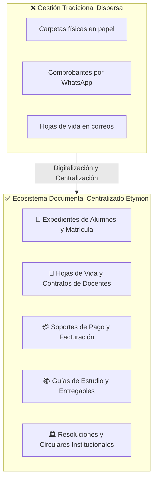
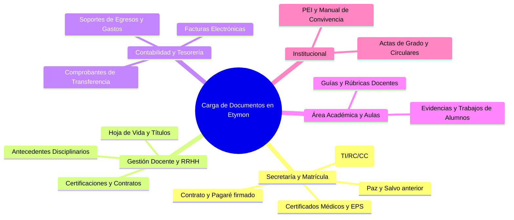
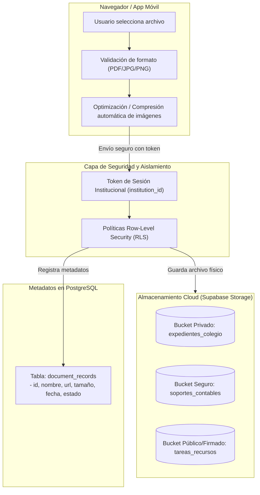
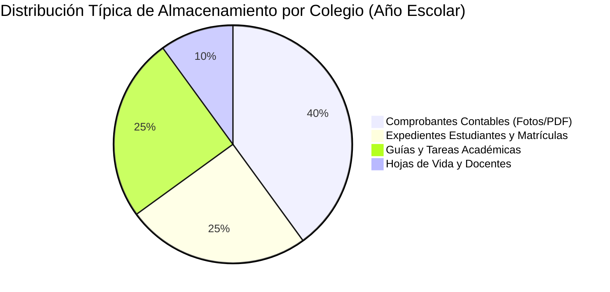
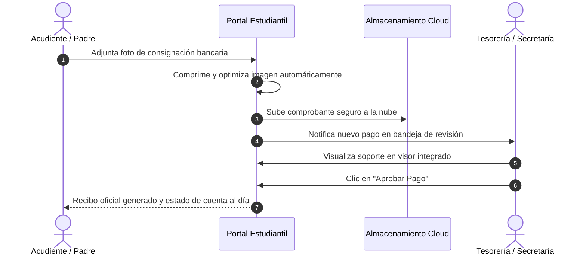
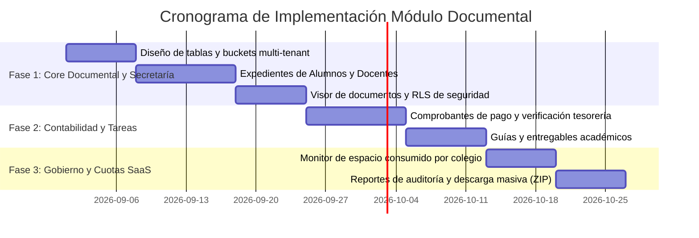

# Análisis de Viabilidad e Implicaciones: Módulo de Carga y Gestión Documental

> **Fecha de Elaboración:** 24 de Agosto de 2026  
> **Sistema:** Plataforma Escolar Multi-Tenant Etymon / Instituto ABC  
> **Destinatarios:** Dirección General, Rectoría y Comité Administrativo  
> **Objetivo:** Evaluar la viabilidad funcional, técnica, financiera, legal y operativa de habilitar la carga y almacenamiento de documentos en la plataforma.

---

## 1. Resumen Ejecutivo

Habilitar la **carga y gestión centralizada de documentos** en la plataforma escolar transforma el software de un libro de calificaciones y contabilidad tradicional a un **sistema operativo escolar integral (All-in-One)**. 

Actualmente, los colegios gestionan archivos físicos en carpetas de papel (hojas de vida de profesores, certificados médicos de alumnos, comprobantes de pago de pensiones y pagarés) o dependen de canales dispersos como WhatsApp y correos electrónicos. 

Incorporar esta capacidad representa un **salto cualitativo de alto valor percibido**, permitiendo digitalizar el 100% de la secretaría académica y tesorería escolar, al tiempo que abre nuevas oportunidades de ingresos en el modelo de suscripciones SaaS mediante planes de almacenamiento.

---

## 2. Casos de Uso por Módulo y Beneficios Operativos

La carga de documentos tiene un impacto transversal en todas las áreas de la institución educativa:

### 2.1 Detalle de Aplicación Operativa

| Área / Módulo | Tipo de Documentos a Subir | ¿Quién lo Sube? | ¿Quién lo Consulta? | Beneficio Administrativo Clave |
| :--- | :--- | :--- | :--- | :--- |
| **Estudiantes y Matrículas** | Documentos de identidad, certificados médicos, constancias de notas de años anteriores, paz y salvo. | Padre de Familia / Secretaría | Rector, Coordinador, Secretaría | Matrícula 100% virtual sin filas ni fotocopias en secretaría. |
| **Docentes y Talento Humano** | Hoja de vida (PDF), títulos universitarios, antecedentes policiales/procuraduría, contrato laboral. | Docente / Rector | Rector, Talento Humano | Auditorías del Ministerio de Educación rápidas y sin carpetas extraviadas. |
| **Contabilidad y Pensiones** | Comprobante de consignación/transferencia bancaria (foto/PDF), soportes de gastos de caja menor. | Padre de Familia / Tesorero | Contador, Tesorero, Rector | Conciliación de pagos bancarios 3 veces más rápida, reduciendo la morosidad. |
| **Tareas y Aulas Virtuales** | Guías de trabajo, lecturas complementarias, talleres en PDF/Word, entregables de alumnos. | Docente / Estudiante | Docentes, Estudiantes, Padres | Centralización pedagógica y portafolio digital de evidencias de aprendizaje. |
| **Institucional y Comunicados** | Manual de convivencia, Proyecto Educativo Institucional (PEI), circulares, actas de grado. | Rector / Administrador | Toda la comunidad educativa | Comunicación oficial unificada y validez institucional. |

---

## 3. Implicaciones Técnicas y de Arquitectura

Para que la carga de documentos funcione de manera fluida, segura y sin encarecer la infraestructura, se debe implementar una arquitectura optimizada bajo los siguientes pilares:

### 3.1 Estructura de Almacenamiento y Seguridad (Multi-Tenant)

> [!IMPORTANT]
> **Aislamiento Estricto por Colegio:** Ningún colegio debe poder acceder a los documentos de otro. La estructura de almacenamiento organiza las rutas físicas mediante el identificador institucional:
> `/{institution_id}/{modulo}/{entidad_id}/{archivo_unico.ext}`

1. **Niveles de Privacidad:**
   - **Documentos Sensibles (Privados):** Hojas de vida de docentes, documentos de identidad de menores y comprobantes de pago solo se sirven mediante **URLs firmadas temporales** (enlaces que expiran en 15-30 minutos).
   - **Recursos Académicos e Institucionales:** Guías pedagógicas y manuales de convivencia accesibles para usuarios autenticados del colegio correspondiente.
2. **Control de Formatos y Tamaños:**
   - Formatos permitidos: `.pdf`, `.png`, `.jpg`, `.jpeg`, `.webp`, `.docx`, `.xlsx`.
   - Bloqueo automático de archivos ejecutables (`.exe`, `.bat`, `.js`) para blindar la plataforma contra malware.
   - Límite de tamaño sugerido: Máximo **5 MB a 10 MB** por archivo.
3. **Optimización en el Dispositivo (Cliente):**
   - El sistema ya cuenta con tecnología de optimización de imágenes (convertidor a formato WebP ligero). Al subir fotos de comprobantes o documentos escaneados desde el celular, el peso se reduce hasta un 85% antes de enviarlo al servidor, ahorrando datos y espacio.

---

## 4. Implicaciones Legales, Seguridad y Protección de Datos

Al almacenar documentos de menores de edad y personal docente, la institución debe cumplir rigurosamente con la normativa de protección de datos:

> [!CAUTION]
> **Tratamiento de Datos Sensibles (Ley 1581 de 2012 de Habeas Data):**
> - Los documentos de identidad y certificados médicos de menores son legalmente considerados **datos de carácter sensible**.
> - La plataforma debe exigir autorización de tratamiento de datos al momento del registro y firma de matrícula.
> - Se debe habilitar un registro de auditoría (*Logs*) que indique qué usuario visualizó, descargó o modificó un documento sensible.

### Medidas de Cumplimiento Integradas:

1. **Derecho al Olvido y Cancelación:** Mecanismo para dar de baja o archivar expedientes cuando un estudiante o docente finaliza su vínculo con la institución.
2. **Cifrado en Tránsito y Reposo:** Todos los archivos viajan encriptados bajo protocolo HTTPS/TLS y se almacenan cifrados en los servidores cloud.
3. **Trazabilidad de Verificación:** Flujo de estados para secretaría y contabilidad: `Pendiente de Verificación` ➔ `Aprobado` ➔ `Rechazado (con motivo para corrección)`.

---

## 5. Análisis Financiero y Modelo de Negocio SaaS

La incorporación de documentos no solo es factible, sino que fortalece la monetización de la plataforma mediante la estructuración de cuotas de almacenamiento.

### 5.1 Estimación de Consumo de Almacenamiento

Un colegio promedio con **300 estudiantes y 20 docentes**:
- **Expedientes de matrícula:** 300 alumnos × 3 documentos promedio (1 MB c/u optimizado) = **~900 MB**.
- **Comprobantes de pensión:** 300 alumnos × 10 meses × 1 comprobante (300 KB c/u) = **~900 MB**.
- **Hojas de vida de docentes:** 20 docentes × 5 MB = **~100 MB**.
- **Tareas y material didáctico:** **~2.0 GB / año**.
- **Consumo Total Anual Estimado:** **~3.9 GB por colegio / año**.

### 5.2 Estructura de Costos vs. Propuesta de Monetización

> [!TIP]
> **Margen Operativo Excepcional:** En proveedores cloud como Supabase / AWS S3, el costo por Gigabyte adicional es de aproximadamente **$0.021 USD/mes** (~$85 COP por GB/mes). Esto permite ofrecer paquetes de almacenamiento con márgenes superiores al 90%.

| Plan Comercial | Cuota de Almacenamiento Incluida | Módulos Documentales Habilitados | Tarifa Mensual Sugerida (COP) |
| :--- | :---: | :--- | :---: |
| **Plan Esencial** | **2 GB** | Solo guías pedagógicas básicas y logos institucionales. | **$150,000 COP** |
| **Plan Pro** | **15 GB** | Expedientes de alumnos, docentes y comprobantes de contabilidad. | **$300,000 COP** |
| **Plan Integral** | **50 GB** | Gestión documental total, archivo histórico y actas oficiales. | **$550,000 COP** |
| **Paquete Extra (+20 GB)** | **+20 GB** | Almacenamiento extendido para colegios grandes (>600 alumnos). | **+$35,000 COP/mes** |

---

## 6. Experiencia de Usuario (UX) Diseñada

Para asegurar una adopción rápida por parte de padres de familia y docentes sin capacitaciones complejas, la interfaz incluye:

1. **Visor de Documentos Integrado (PDF y Fotos):** Permite al rector o contador revisar el comprobante o diploma en pantalla completa dentro del sistema, sin necesidad de descargar el archivo a su computador personal.
2. **Barra de Progreso de Documentación de Matrícula:** Un semáforo visual para secretaría:
   - 🟢 *Verificado (4/4 documentos)*
   - 🟡 *En revisión (1 documento pendiente de validación)*
   - 🔴 *Incompleto (Falta certificado médico)*
3. **Carga Rápida desde el Móvil (Drag & Drop / Cámara):** Los padres pueden tomar la foto de la consignación directamente desde su celular o arrastrar el archivo PDF desde el computador.

---

## 7. Plan de Implementación Recomendado (Hoja de Ruta)

Para una adopción controlada y sin riesgos operativos, se recomienda una ejecución en **3 fases incrementales**:

### Detalle de Fases:

- **Fase 1: Repositorio Central de Secretaría (2 a 3 semanas):**
  - Creación de tabla maestra `document_records` y políticas de seguridad RLS en base de datos.
  - Subida de documentos en el perfil del estudiante (identidad, certificado EPS, notas anteriores).
  - Subida de documentos en el perfil del docente (hoja de vida, diplomas, antecedentes).
  - Visor modal integrado para previsualizar PDFs e imágenes.

- **Fase 2: Soportes de Tesorería y Tareas (2 semanas):**
  - Módulo de validación de comprobantes de pago en el módulo de Contabilidad.
  - Interfaz de aprobación/rechazo de pagos para el tesorero.
  - Carga de guías pedagógicas enriquecidas para docentes.

- **Fase 3: Control Administrativo y Cuotas de Almacenamiento (1 a 2 semanas):**
  - Indicador de consumo de disco por colegio en el panel de Super Administrador (Etymon).
  - Alertas automáticas al rector cuando su colegio alcanza el 85% de la cuota contratada.
  - Herramienta de descarga masiva de expedientes en archivo comprimido (`.zip`) para cierres de año lectivo.

---

## 8. Conclusiones y Recomendación Final

> [!NOTE]
> ### Veredicto Ejecutivo
> **Altamente Viable y Estratégico.** La plataforma ya cuenta con la infraestructura base (Supabase Storage, compresión WebP y arquitectura multi-tenant con RLS). 
>
> Implementar la carga y gestión de documentos:
> 1. **Diferencia a Etymon** de los sistemas escolares tradicionales rígidos.
> 2. **Justifica de inmediato los planes Pro e Integral** ($300k - $550k COP/mes), acelerando el retorno de inversión.
> 3. **Elimina fricción operativa** en colegios al sustituir el archivo físico en papel por un repositorio digital seguro y accesible 24/7.
