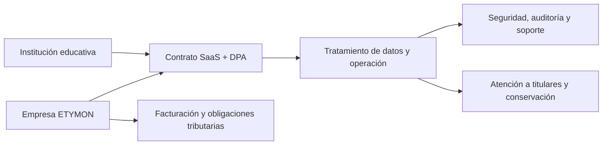

# Análisis de legalidad y operación de ETYMON en Colombia

> [!IMPORTANT]
> Este documento es una guía de priorización para el producto y no reemplaza una revisión de abogado, contador y responsable de protección de datos. No es correcto publicar que la plataforma está “legalizada” o “certificada” hasta contar con soportes verificables de cada punto aplicable.

## Propósito

ETYMON es una plataforma SaaS educativa que puede tratar datos de estudiantes, familias y personal de instituciones. Por esa razón, la operación combina obligaciones empresariales, tributarias, contractuales, de protección de datos y de gestión documental. La institución y la plataforma no tienen exactamente las mismas responsabilidades.

## Matriz de requisitos

| Frente | Qué debe comprobarse | Responsable principal | Evidencia mínima |
|---|---|---|---|
| Formalización empresarial | Matrícula mercantil si aplica, RUT/NIT, representante y actividad económica correctos | ETYMON | Certificado, RUT y decisiones societarias vigentes |
| Tributario | Determinación de impuestos, facturación y soportes de cobro | ETYMON + contador | Configuración DIAN, facturas y contratos |
| Datos personales | Política, avisos, canales de titulares, registro de autorizaciones y contratos con encargados | Institución (responsable) + ETYMON (encargado) | Política aprobada, DPA, inventario de datos y evidencia de consentimientos |
| Menores y datos sensibles | Finalidad necesaria, interés superior, autorización válida cuando corresponda y alternativa no biométrica | Ambos | Matriz de finalidades y consentimientos granulares |
| Seguridad | Accesos por rol, aislamiento institucional, respaldo, auditoría e incidentes | ETYMON | Evaluaciones, logs, procedimientos y contratos de subencargados |
| Evidencia electrónica | Aceptación verificable de contratos, términos y consentimientos | Ambos | Fecha/hora, identidad, versión, hash/texto y trazabilidad |
| Archivo escolar | Retención, consulta y disposición final de expedientes según la institución | Institución | Tabla de retención y procedimiento de exportación/eliminación |
| Transparencia comercial | Información completa del proveedor, precio, alcance, soporte y terminación | ETYMON | Términos, propuesta comercial, PQR y contrato |

## Prioridad de implementación

1. Identificar formalmente al proveedor ETYMON y revisar RUT, matrícula, actividad económica, contabilidad y facturación con un profesional tributario.
2. Firmar por cada colegio un contrato SaaS y un acuerdo de tratamiento de datos que diferencie claramente Responsable y Encargado.
3. Completar el inventario de datos y finalidades. La biometría, salud y datos de NNA requieren revisión reforzada; no deben ser condición automática para acceder al servicio educativo.
4. Nombrar un canal o responsable de protección de datos y publicar políticas que coincidan con la operación real.
5. Formalizar controles de seguridad, gestión de proveedores de nube, atención de incidentes, exportación y eliminación de información.
6. Validar la necesidad de RNBD y cualquier obligación sectorial adicional con base en la naturaleza concreta de cada Responsable.

> [!NOTE]
> La Ley 527 de 1999 permite el uso de mensajes de datos y reconoce métodos de firma si identifican al iniciador y expresan aprobación de manera confiable y adecuada al propósito. No toda aceptación electrónica equivale automáticamente a una firma digital certificada: el método debe analizarse según el acto y el riesgo.

## Referencias oficiales

- [Ventanilla Única Empresarial: guía previa a la creación de empresa](https://www.vue.gov.co/ventanilla-unica-empresarial/guia-para-crear-y-hacer-crecer-su-empresa/guia-previa-a-la-creacion-de-su-empresa)
- [DIAN: ser facturador electrónico](https://www.dian.gov.co/impuestos/factura-electronica/como-hacerlo/Paginas/ser-facturador-electronico.aspx)
- [SIC: política y deberes de tratamiento de datos personales](https://sedeelectronica.sic.gov.co/politica-de-tratamiento-de-datos-personales)
- [MINTIC: RNBD y Decreto 886 de 2014, compilado en Decreto 1074 de 2015](https://normograma.mintic.gov.co/mintic/compilacion/docs/decreto_0886_2014.htm)
- [SUIN: Ley 527 de 1999](https://www.suin-juriscol.gov.co/viewDocument.asp?id=1662013)
- [Función Pública: Ley 594 de 2000](https://www.funcionpublica.gov.co/eva/gestornormativo/norma.php?i=4275)
