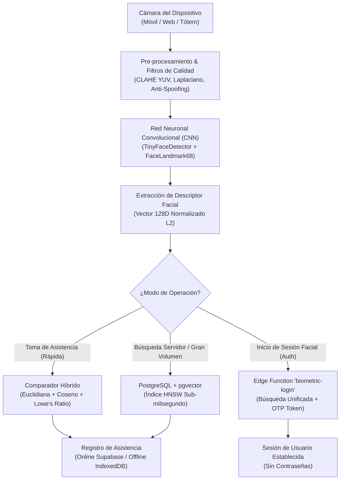
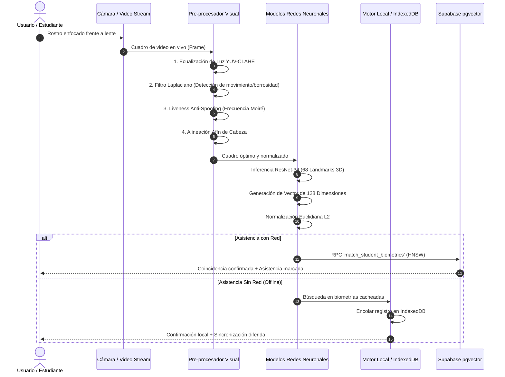
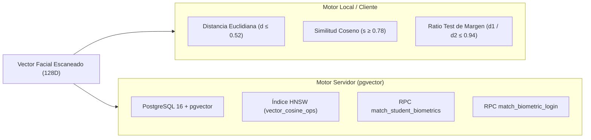
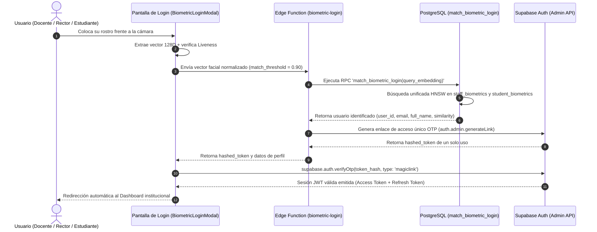
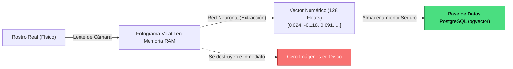

# Arquitectura y Funcionamiento del Core de Reconocimiento Facial

Este documento detalla el diseño técnico, flujo de datos, algoritmos de visión artificial y mecanismos de seguridad del **Core de Reconocimiento Facial** implementado en la plataforma.

---

## 1. Resumen Ejecutivo y Propósito

El sistema de reconocimiento facial de la plataforma fue diseñado bajo tres principios fundamentales:

1. **Privacidad y Cumplimiento Estricto (Privacy by Design):** **No se almacenan fotografías ni videos** de estudiantes, docentes o directivos. El sistema convierte los rasgos del rostro en un descriptor matemático irreversible (un vector de 128 números flotantes).
2. **Alta Velocidad y Escalabilidad:** Detección en tiempo real en dispositivos cliente (móviles, tablets, ordenadores) combinada con búsquedas espaciales sub-milisegundo en base de datos mediante **PostgreSQL + pgvector (Índice HNSW)**.
3. **Resiliencia Operativa Offline-First:** Capacidad de registrar asistencia y validar identidades en aulas con conectividad nula o inestable mediante almacenamiento seguro en **IndexedDB** y sincronización automática en cola.



---

## 2. Pipeline de Visión por Computadora (Paso a Paso)

El procesamiento facial opera directamente en el navegador del usuario (Edge AI), aprovechando la aceleración por hardware (WebGL / WebAssembly).



### 2.1 Pre-procesamiento de Imagen y Filtros de Calidad

Para evitar falsos rechazos causados por las condiciones reales de las instituciones educativas (luces fluorescentes, contraluz de ventanas, sombras), el sistema aplica una cadena de pre-procesamiento:

1. **Ecualización Adaptativa de Histograma YUV (CLAHE):**
   * Convierte la imagen RGB al espacio de color $YUV$ y procesa únicamente el canal de luminancia $Y$.
   * Redistribuye el contraste local mediante límites de corte (`clipLimit = 2.5`), neutralizando sombras oscuras y sobreexposición sin alterar los tonos de piel.
2. **Detección de Desenfoque por Movimiento (Varianza Laplaciana):**
   * Aplica un kernel Laplaciano $3 \times 3$ $\begin{bmatrix} 0 & 1 & 0 \\ 1 & -4 & 1 \\ 0 & 1 & 0 \end{bmatrix}$.
   * Si la varianza calculada es inferior a $40$, el fotograma se descarta automáticamente para evitar registrar rostros movidos.
3. **Mecanismo Anti-Spoofing & Liveness:**
   * Evalúa la derivada de alta frecuencia espacial entre píxeles adyacentes para detectar el patrón de rejilla (*Efecto Moiré*) característico de pantallas de teléfonos o impresiones fotográficas.
   * Si el índice de Moiré supera el $18\%$, la captura se clasifica como intento de suplantación (`isSpoof = true`).
4. **Verificación de Morfología Humana y Pigmentación:**
   * Mide la presencia de tonos de piel en el óvalo central y valida el contraste topográfico entre las tres bandas faciales (frente, zona interocular/nariz y mentón).
   * Descarta reflejos de luz en paredes, manos, dedos tapando la lente o fondos estáticos.
5. **Alineación Afín de Ángulo de Cabeza (Roll Angle):**
   * Estima la inclinación lateral de la cabeza ($\pm 15^\circ$) mediante el centroide de luminosidad interocular y aplica una rotación afín compensatoria en el lienzo de captura.

> [!NOTE]
> Todo este pre-procesamiento se ejecuta en memoria a más de 30 cuadros por segundo, garantizando una respuesta instantánea y fluida para el usuario.

---

## 3. Representación Vectorial y Normalización (128-D Embedding)

El núcleo neuronal (basado en arquitectura ResNet-34) mapea la fisionomía del rostro en un espacio euclidiano de **128 dimensiones**. 

Cada posición del vector representa distancias relativas, curvaturas y proporciones estructurales invariantes a la expresión facial:

$$\vec{v} = \begin{bmatrix} v_1 & v_2 & v_3 & \dots & v_{128} \end{bmatrix}$$

### Normalización L2 Unitaria
Para que las comparaciones sean matemáticamente estables e independientes de la escala de captura, cada vector se normaliza a norma unitaria:

$$\hat{v} = \frac{\vec{v}}{\|\vec{v}\|_2} = \frac{\vec{v}}{\sqrt{\sum_{i=1}^{128} v_i^2}}$$

### Enrolamiento de Alta Precisión por Centroide
Durante el registro de un estudiante o docente, el sistema no toma una sola captura aislada; toma una **ráfaga de muestras estables** y calcula el **vector centroide promedio**:

$$\vec{v}_{\text{centroide}} = \text{Normalize}\left(\frac{1}{N}\sum_{k=1}^{N} \hat{v}^{(k)}\right)$$

Esto elimina micro-variaciones por parpadeo o cambios leves de postura, produciendo una huella biométrica de máxima estabilidad.

---

## 4. Motores de Búsqueda y Algoritmos de Emparejamiento

La plataforma dispone de dos motores de búsqueda complementarios:



### 4.1 Motor Local: Validación Dual y Ratio Test
Para la toma de asistencia en aula o modo offline, el comparador local exige cumplir tres condiciones simultáneas:

1. **Distancia Euclidiana:** $\text{dist}(\hat{u}, \hat{w}) = \sqrt{\sum_{i=1}^{128} (u_i - w_i)^2} \le 0.52$
2. **Similitud Coseno:** $\text{sim}(\hat{u}, \hat{w}) = \hat{u} \cdot \hat{w} \ge 0.78$ ($78\%$ de confianza mínima).
3. **Prueba de Margen de Ambigüedad (Lowe's Ratio Test):**
   * Compara la distancia del mejor candidato ($d_1$) contra la del segundo mejor candidato ($d_2$):
   $$\text{MarginRatio} = \frac{d_1}{d_2}$$
   * Si $\text{MarginRatio} > 0.94$, el sistema rechaza la coincidencia por riesgo de ambigüedad (útil en presencia de familiares o hermanos con facciones similares).

### 4.2 Motor Servidor: Búsquedas Sub-Milisegundo con pgvector e Índice HNSW
En el servidor PostgreSQL, las tablas `student_biometrics` y `staff_biometrics` cuentan con columnas nativas `vector(128)` indexadas mediante **HNSW** (*Hierarchical Navigable Small World*):

```sql
create index student_biometrics_hnsw_idx
  on public.student_biometrics
  using hnsw (vec_embedding extensions.vector_cosine_ops);
```

* **Complejidad:** Reduce el tiempo de búsqueda de $O(N)$ (búsqueda lineal) a $O(\log N)$.
* **Rendimiento:** Permite identificar a un individuo entre decenas de miles de registros en **menos de 3 milisegundos**.

---

## 5. Módulos y Casos de Uso Integrados

| Módulo | Componente Principal | Función y Mecánica | Nivel de Seguridad |
| :--- | :--- | :--- | :--- |
| **Asistencia Móvil en Aula** | [MobileFacialScanner.tsx](file:///e:/iabc/src/components/biometrics/MobileFacialScanner.tsx) | Escaneo en lote con cámara trasera/frontal. Detección automática por semáforo de colores y retroalimentación de voz. | Tolerancia: `0.52`, Umbral: `78%` |
| **Enrolamiento de Estudiantes** | [BiometricEnrollmentModal.tsx](file:///e:/iabc/src/components/biometrics/BiometricEnrollmentModal.tsx) | Captura progresiva multi-muestra con cálculo de centroide promedio. | 3 muestras consistentes requeridas |
| **Enrolamiento de Personal** | [StaffBiometricEnrollmentModal.tsx](file:///e:/iabc/src/components/teachers/StaffBiometricEnrollmentModal.tsx) | Registro facial de directivos, docentes y personal administrativo. | Validación RLS por rol de Rector |
| **Inicio de Sesión Facial** | [BiometricLoginModal.tsx](file:///e:/iabc/src/components/biometrics/BiometricLoginModal.tsx) / [useBiometricLogin.ts](file:///e:/iabc/src/hooks/school/useBiometricLogin.ts) | Acceso a la plataforma sin contraseña mediante coincidencia facial y token OTP Magic Link. | Umbral estricto: `≥ 90%` |
| **Resiliencia Fuera de Línea** | [biometricOfflineCache.ts](file:///e:/iabc/src/utils/biometricOfflineCache.ts) | Caché en IndexedDB y cola de sincronización diferida para zonas sin internet. | Persistencia local encriptada por origen |

---

## 6. Inicio de Sesión Biométrico (Biometric Auth Flow)

El inicio de sesión facial reemplaza contraseñas vulnerables mediante un flujo seguro de autenticación delegado en el backend:



> [!IMPORTANT]
> El endpoint de autenticación biométrica exige un umbral de coincidencia superior al **90%** (`threshold >= 0.90`) para prevenir cualquier falso positivo en el acceso a cuentas de usuario.

---

## 7. Privacidad, Ética y Seguridad de la Información

La arquitectura biométrica de la plataforma cumple con los más altos estándares internacionales de protección de datos personales y de menores de edad (GDPR / Leyes de Protección de Datos):



1. **Irreversibilidad Matemática:** Es matemáticamente imposible reconstruir la imagen del rostro original a partir del vector de 128 números. Un embedding no es una imagen; es una firma numérica de distancias relativas.
2. **Destrucción Inmediata de Fotogramas:** Los cuadros de video se procesan en la memoria RAM del navegador y se descartan al instante. Nunca se envían fotografías a través de la red ni se guardan archivos `.jpg`/`.png`.
3. **Aislamiento por Políticas RLS:** En la base de datos, las tablas biométricas están protegidas con **Row Level Security (RLS)**. Los docentes solo tienen acceso a los vectores de los estudiantes que tienen asignados en sus cursos, y únicamente los directivos con rol de Rector pueden gestionar la información institucional.

---

## 8. Conclusiones y Recomendaciones de Operación

> [!TIP]
> **Buenas Prácticas para el Personal Docente y Administrativo:**
> * **Iluminación:** Aunque el sistema cuenta con ecualización adaptativa CLAHE, se recomienda una iluminación frontal suave evitando luces incandescentes directas detrás de la persona.
> * **Distancia de Encuadre:** La distancia recomendada para enrolamiento y escaneo en aula es de **40 a 70 centímetros** respecto a la cámara.
> * **Uso de Accesorios:** Se recomienda enrolar a los estudiantes sin gafas oscuras ni gorras que oculten la línea interocular o la frente. Gafas formuladas transparentes habituales no interfieren con la precisión del modelo.
