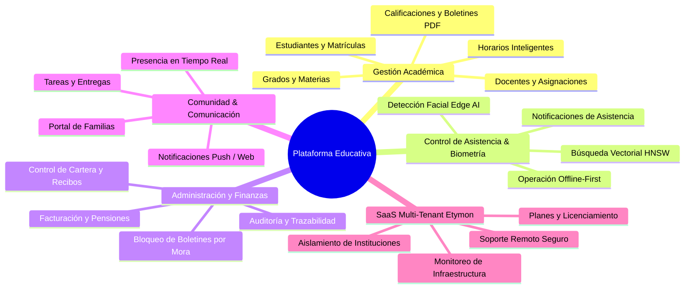
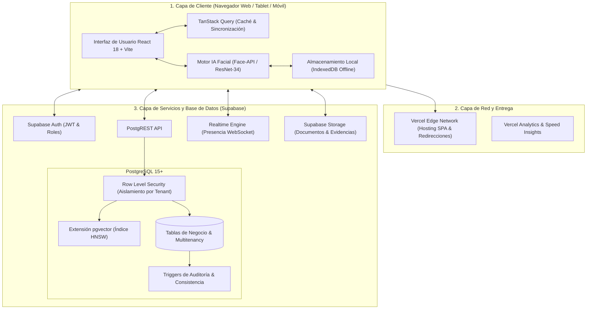
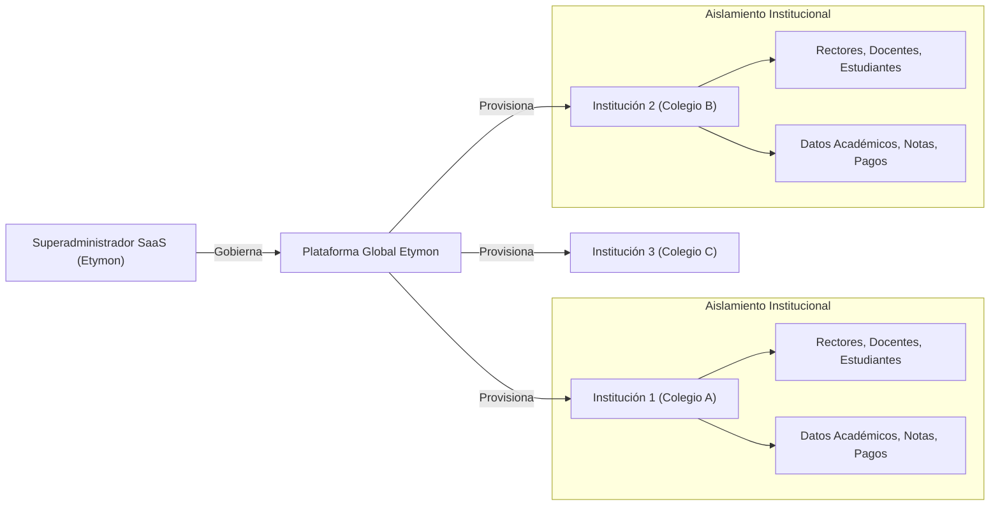
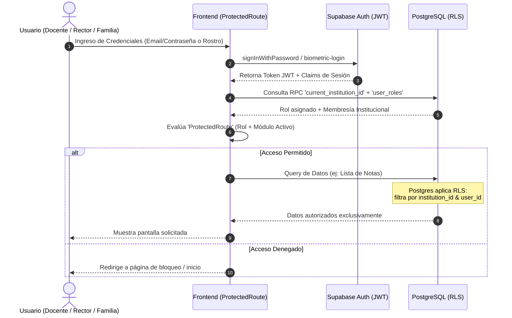
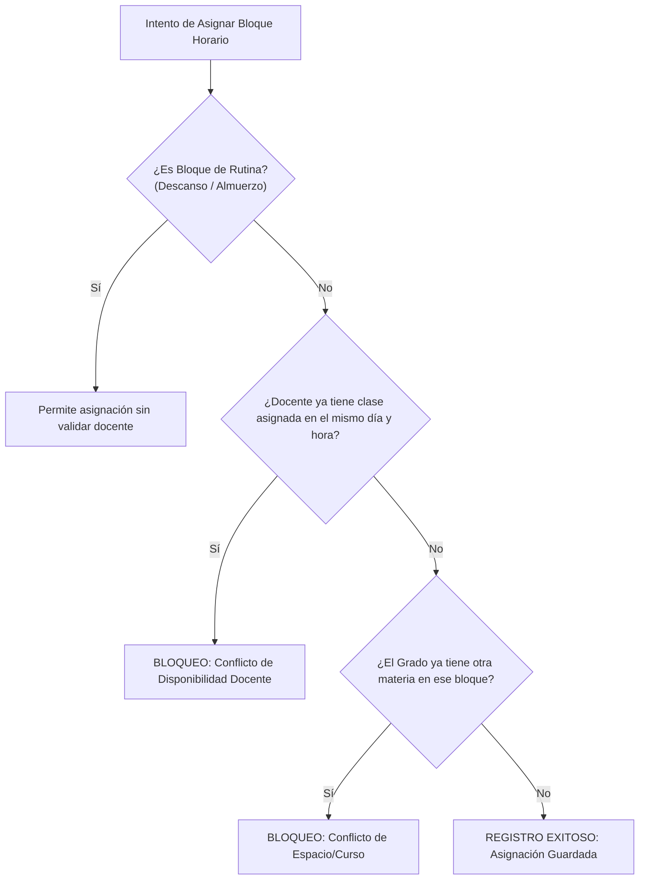
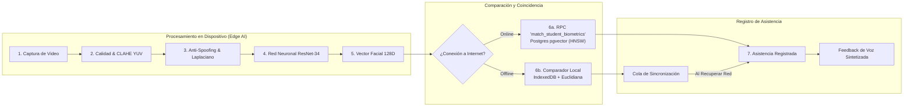
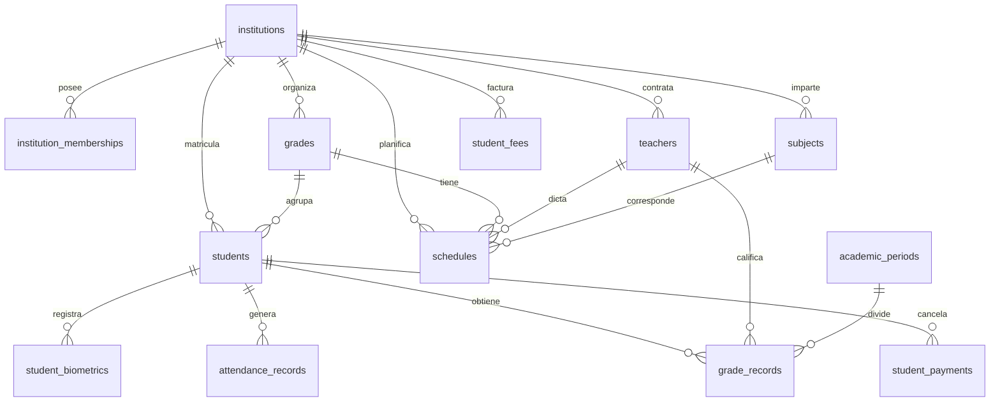

# Manual Técnico Integral y Arquitectura de la Plataforma

**Plataforma de Gestión Escolar & Ecosistema SaaS Multi-Institución**  
*Versión del Sistema: 2.0 (Producción / Arquitectura Multi-Tenant)*  
*Fecha de Emisión: Agosto 2026*

---

## Tabla de Contenidos
1. [Resumen Ejecutivo y Visión General](#1-resumen-ejecutivo-y-visión-general)
2. [Arquitectura General del Sistema](#2-arquitectura-general-del-sistema)
3. [Ecosistema Multi-Tenant y Panel Proveedor (Etymon)](#3-ecosistema-multi-tenant-y-panel-proveedor-etymon)
4. [Modelo de Autenticación, Roles y Seguridad (RBAC & RLS)](#4-modelo-de-autenticación-roles-y-seguridad-rbac--rls)
5. [Módulos Funcionales del Negocio](#5-módulos-funcionales-del-negocio)
   - 5.1. Gestión Académica (Estudiantes, Docentes, Grados y Materias)
   - 5.2. Planificación de Horarios y Algoritmo Anticolisiones
   - 5.3. Calificaciones, Evaluaciones Cualitativas y Motor PDF
   - 5.4. Tareas y Compromisos Académicos
   - 5.5. Módulo Contable y Recaudos de Pensiones
   - 5.6. Portal de Familias y Estudiantes
6. [Core de Reconocimiento Facial y Asistencias Biométricas](#6-core-de-reconocimiento-facial-y-asistencias-biométricas)
   - 6.1. Pipeline de Visión por Computadora (Edge AI)
   - 6.2. Motor Vectorial y Búsqueda HNSW en Base de Datos
   - 6.3. Modo Offline-First y Sincronización
   - 6.4. Telemetría, Privacidad y Anti-Suplantación (Anti-Spoofing)
7. [Modelo de Datos y Gobierno de Base de Datos](#7-modelo-de-datos-y-gobierno-de-base-de-datos)
8. [Guía de Operación, Mantenimiento y Despliegue](#8-guía-de-operación-mantenimiento-y-despliegue)
9. [Matriz de Solución de Problemas Frecuentes (Troubleshooting)](#9-matriz-de-solución-de-problemas-frecuentes-troubleshooting)

---

## 1. Resumen Ejecutivo y Visión General

La plataforma **Instituto ABC** es una solución tecnológica integral diseñada para optimizar los procesos pedagógicos, operativos, financieros y de control de acceso de instituciones educativas. Originalmente concebida para la gestión escolar unificada, la plataforma ha evolucionado hacia una **arquitectura SaaS Multi-Tenant** que permite operar múltiples colegios de forma aislada, segura y escalable desde una única infraestructura cloud gobernada por el panel **Etymon**.



> [!NOTE]
> **Enfoque de Desarrollo:** La plataforma sigue el estándar **SPA (Single Page Application)** moderna, con renderizado veloz del lado del cliente, computación de Inteligencia Artificial en el navegador (Edge Computing) y servicios de datos de alta disponibilidad respaldados por políticas de seguridad a nivel de fila (**Row Level Security - RLS**).

---

## 2. Arquitectura General del Sistema

El sistema implementa una arquitectura desacoplada y reactiva en tres capas principales:

1. **Capa de Presentación (Frontend SPA):** Desarrollada con React 18, TypeScript y Vite 5. Utiliza Tailwind CSS y shadcn/ui para una experiencia visual de alto estándar, junto con TanStack Query para el manejo de estado remoto y caché asíncrono.
2. **Capa de Lógica Distribuida e Inteligencia Artificial:** Ejecución de redes neuronales convolucionales (CNN) en el cliente mediante WebGL/WASM para biometría facial, y Edge Functions en Supabase para tareas de integración y procesamiento serverless.
3. **Capa de Persistencia y Seguridad (BaaS - Supabase / PostgreSQL):** Base de datos relacional PostgreSQL con extensiones vectoriales (`pgvector`), motor de autenticación JWT y almacenamiento de archivos cifrados.



### Tabla Resumen del Stack Tecnológico

| Capa / Componente | Tecnología | Versión / Detalle | Propósito Principal |
| :--- | :--- | :--- | :--- |
| **Framework Base** | React | 18.3.1 | Construcción de interfaces reactivas modulares |
| **Empaquetador** | Vite | 5.4.19 | Compilación ultrarrápida y Hot Module Replacement |
| **Lenguaje** | TypeScript | 5.8.3 | Tipado estricto y prevención de errores de ejecución |
| **Diseño y Estilos** | Tailwind CSS + Radix UI | 3.4.17 / Radix Primitives | Sistema de componentes accesibles y diseño fluido |
| **Gestión de Estado** | TanStack Query | 5.83.0 | Cacheo inteligente de queries y mutaciones optimistas |
| **Visión Artificial** | `@vladmandic/face-api` | 1.7.15 (TensorFlow/WASM) | Detección de rostros y descriptores 128D en el navegador |
| **Generación Documental**| jsPDF + AutoTable | 4.0.0 / 5.0.7 | Creación cliente de boletines, reportes y recibos |
| **Base de Datos / BaaS** | Supabase (PostgreSQL) | 15+ con `pgvector` | Persistencia relacional, RLS multi-tenant y Realtime |
| **Infraestructura Web** | Vercel | SPA Routing (`vercel.json`) | CDN global, métricas de rendimiento y entrega continua |

---

## 3. Ecosistema Multi-Tenant y Panel Proveedor (Etymon)

La plataforma soporta múltiples instituciones educativas en una única base de datos garantizando estricta confidencialidad mediante **Aislamiento Multi-Tenant**.



### 3.1. Estructura de Tablas Multi-Tenant
* `institutions`: Almacena las entidades educativas registradas, su slug de acceso personalizado, colores de marca y estado (activo, suspendido, bloqueado).
* `institution_memberships`: Asocia cada usuario (`auth.users`) a una o más instituciones definiendo su rol institucional.
* `institution_settings`: Parámetros de configuración específicos (período escolar activo, escala de calificación, días de gracia para pensiones).
* `subscription_plans` & `institution_subscriptions`: Control de planes de contratación (Básico, Profesional, Enterprise) y vigencia del servicio.
* `institution_module_entitlements`: Habilitación granular de módulos según el plan adquirido (por ejemplo: habilitar o desactivar el módulo contable o el biométrico).

### 3.2. Panel de Administración del Proveedor (`/etymon`)
Permite a los administradores del software:
1. **Control de Instituciones:** Crear colegios, configurar branding institucional (logos, colores CSS primarios) y suspender accesos por mora de licencia.
2. **Monitoreo de Presencia en Tiempo Real (`/etymon/en-linea`):** Visualización de usuarios activos en la plataforma mediante canales Supabase Realtime Presence, identificando rol, institución y dispositivo.
3. **Modo Soporte Técnico Seguro:** Los administradores de Etymon pueden acceder en modo de asistencia auditado a la institución que requiera ayuda sin alterar contraseñas de usuarios.

---

## 4. Modelo de Autenticación, Roles y Seguridad (RBAC & RLS)

La seguridad se estructura en dos niveles: validación de permisos en la interfaz de usuario (Frontend RBAC) y cumplimiento forzoso e inquebrantable en la base de datos (Database RLS).



### 4.1. Matriz de Roles y Permisos en el Sistema

| Módulo / Función | Rector (`rector`) | Docente (`profesor`) | Acudiente (`parent`) | Contador (`contable`) | Proveedor (`provider_owner`) |
| :--- | :---: | :---: | :---: | :---: | :---: |
| **Dashboard Principal** | Acceso Total Institucional | Métricas de sus Cursos | Vista de sus Hijos | Métricas Financieras | Panel Global Etymon |
| **Gestión de Profesores** | Crear, Editar, Asignar | Solo Lectura de Perfil | Sin Acceso | Solo Lectura de Perfiles | Administración Global |
| **Estudiantes y Matrículas** | Total | Lectura de sus Cursos | Solo sus Hijos | Solo datos de matrícula | Configuración Global |
| **Horarios de Clase** | Configuración Total | Consulta de su Horario | Consulta de Horario Hijo | Sin Acceso | Sin Acceso |
| **Calificaciones y Boletines** | Supervisión y Emisión | Edición de su Carga | Consulta de sus Hijos | Sin Acceso | Sin Acceso |
| **Asistencias y Biometría** | Control General | Registro de Asistencia | Consulta de Asistencias | Sin Acceso | Diagnóstico de IA |
| **Tareas y Compromisos** | Supervisión General | Creación y Calificación | Entrega y Consulta | Sin Acceso | Sin Acceso |
| **Contabilidad y Pensiones** | Control y Cierre | Sin Acceso | Consulta y Comprobantes | Facturación y Recaudos | Sin Acceso |
| **Gobierno del Sistema** | Usuarios del Colegio | Sin Acceso | Sin Acceso | Sin Acceso | Control Multi-Tenant |

> [!IMPORTANT]
> **Seguridad Fail-Closed:** Si un usuario intenta consultar directamente las APIs de base de datos saltándose la interfaz, las políticas **RLS (Row Level Security)** rechazan la petición a nivel de motor SQL si el `institution_id` o el `user_id` no corresponden con el token JWT autenticado.

---

## 5. Módulos Funcionales del Negocio

### 5.1. Gestión Académica (Estudiantes, Docentes, Grados y Materias)
* **Gestión de Grados y Secciones:** Configuración de la estructura escolar (Preescolar: Párvulos, Prejardín, Jardín, Transición; Primaria: 1° a 5°; Secundaria). Asignación de directores de grupo.
* **Malla Curricular y Asignaturas:** Definición de materias principales y áreas compuestas con soporte jerárquico (`parent_id`, `grade_level`).
* **Asignaciones Académicas:** Matriz que vincula a cada docente con sus materias y grados correspondientes (`teacher_grade_assignments`, `teacher_subjects`).

### 5.2. Planificación de Horarios y Algoritmo Anticolisiones
El generador y gestor de horarios escolares incluye un motor de validación en tiempo real que previene cruces:



### 5.3. Calificaciones, Evaluaciones Cualitativas y Motor PDF
* **Evaluación Primaria y Secundaria:** Calificación cuantitativa con desglose de notas parciales (talleres, quices, exámenes y autoevaluación), calculando automáticamente la definitiva ponderada del período.
* **Evaluación Dimensional de Preescolar:** Calificación cualitativa estructurada por dimensiones del desarrollo (Cognitiva, Comunicativa, Corporal, Socioafectiva, Estética, Ética y Espiritual) con escalas descriptivas (Superior, Alto, Básico, Bajo).
* **Motor de Generación PDF:** Generación en el cliente sin recargar el servidor. Produce boletines por período, consolidados anuales y planillas de control con firmas institucionales y marca de agua.

### 5.4. Tareas y Compromisos Académicos
* Publicación de actividades escolares por parte de los docentes con fecha límite y archivos adjuntos.
* Recepción de entregas digitales de estudiantes/padres con compresión de imágenes automática.
* Retroalimentación y calificación directa vinculada al libro de calificaciones.

### 5.5. Módulo Contable y Recaudos de Pensiones
* Configuración de tarifas por grado y costos adicionales (matrícula, seguro, transporte).
* Generación de cuentas de cobro mensuales (10 meses escolares COP).
* Registro de pagos y emisión instantánea de recibos de caja en PDF.
* **Mecanismo de Retención de Boletines:** Configuración automática que oculta la consulta y descarga de boletines a acudientes con mensualidades vencidas, mostrando una alerta amigable para acercarse a tesorería.

### 5.6. Portal de Familias y Estudiantes (`/portal`)
Unifica en una única vista optimizada para dispositivos móviles:
* **Mis Notas:** Visualización en tiempo real del progreso académico y descarga de boletines.
* **Mi Horario:** Agenda semanal con materias y profesores correspondientes.
* **Mis Asistencias:** Registro de ingresos, ausencias y justificaciones.
* **Mis Tareas:** Calendario de entregas pendientes y calificaciones.
* **Mis Pensiones:** Estado de cuenta, historial de pagos y recibos digitales.

---

## 6. Core de Reconocimiento Facial y Asistencias Biométricas

El sistema integra un módulo de reconocimiento biométrico facial de última generación diseñado bajo el principio de **Privacidad por Diseño (Privacy by Design)**.



### 6.1. Pipeline de Visión por Computadora (Paso a Paso)
1. **Captura y Ecualización:** La cámara captura el cuadro; se aplica ecualización de luz mediante **YUV-CLAHE** (Contrast Limited Adaptive Histogram Equalization) para eliminar sombras duras.
2. **Filtro de Nitidez Laplaciano:** Evalúa la varianza del operador Laplaciano para descartar imágenes desenfocadas o con movimiento.
3. **Anti-Suplantación (Liveness Anti-Spoofing):** Detección de patrones de frecuencia (patrones de Moiré) para evitar que se usen fotos digitales desde celulares frente a la cámara.
4. **Inferencia Neuronal:** Extracción de 68 puntos faciales clave (Landmarks 3D) e inferencia con **ResNet-34**, produciendo un vector matemático único de **128 números decimales** normalizado mediante norma euclidiana L2.

> [!NOTE]
> **Privacidad Absoluta:** En ningún momento se envían ni se guardan fotos de los rostros en los servidores. Únicamente se almacena la firma matemática de 128 dimensiones (`vector(128)`), la cual es irreversible e inutilizable fuera del algoritmo de coincidencia.

### 6.2. Motor Vectorial y Búsqueda HNSW en Base de Datos
* Las firmas se almacenan en la tabla `student_biometrics` utilizando el tipo de dato nativo `vector(128)`.
* La búsqueda se ejecuta mediante la función RPC `match_student_biometrics`, la cual utiliza un **índice HNSW (Hierarchical Navigable Small World)** operando con **Distancia Coseno (`<=>`)**.
* La coincidencia se logra en **menos de 5 milisegundos**, permitiendo tomas de asistencia masivas a la entrada del plantel.

### 6.3. Modo Offline-First y Resiliencia en Aulas
Si la institución sufre cortes de internet:
1. El sistema precarga los descriptores vectoriales del salón en la base de datos local **IndexedDB** del navegador del docente.
2. El reconocimiento se efectúa localmente mediante un comparador híbrido (Distancia Euclidiana + Similitud Coseno + Lowe's Ratio).
3. Las asistencias quedan encoladas localmente y se sincronizan de manera transparente con Supabase en cuanto se restablece la conexión.

---

## 7. Modelo de Datos y Gobierno de Base de Datos

### Diagrama Entidad-Relación Simplificado



### Tabla de Entidades Principales

| Nombre de Tabla | Propósito de Negocio | Claves Foráneas Relevantes | Mecanismo de Seguridad |
| :--- | :--- | :--- | :--- |
| `institutions` | Registro y parametrización de colegios | N/A (Raíz del Tenant) | Solo Provider Owner / Lectura de Tenant |
| `institution_memberships` | Asignación de usuarios a colegios con rol | `user_id`, `institution_id` | RLS: Valida membresía activa |
| `students` | Datos de matrícula y perfil de estudiantes | `institution_id`, `grade_id`, `guardian_id` | RLS por `institution_id` y vínculo familiar |
| `teachers` | Perfil profesional de docentes | `institution_id`, `user_id` | RLS por `institution_id` |
| `grades` | Cursos y niveles académicos | `institution_id`, `director_teacher_id` | RLS por `institution_id` |
| `subjects` | Materias y asignaturas | `institution_id`, `parent_id` (jerárquico) | RLS por `institution_id` |
| `schedules` | Bloques semanales de clase y rutina | `institution_id`, `grade_id`, `subject_id`, `teacher_id` | RLS y constraints anticolisión |
| `grade_records` | Calificaciones periódicas de estudiantes | `student_id`, `subject_id`, `period_id`, `teacher_id` | RLS: Docente de materia o Rector |
| `preescolar_evaluations`| Evaluaciones cualitativas dimensionales | `student_id`, `dimension_id`, `period_id` | RLS: Docente asignado o Rector |
| `student_biometrics` | Firmas vectoriales 128D para reconocimiento | `student_id`, `institution_id` | RLS: Restringido a personal autorizado |
| `attendance_records` | Registro de asistencias diarias | `student_id`, `schedule_id`, `institution_id` | RLS por institución y docente |
| `student_fees` & `student_payments` | Control de pensiones y recibos de caja | `student_id`, `institution_id` | RLS: Rol Contable, Rector y Acudiente |

---

## 8. Guía de Operación, Mantenimiento y Despliegue

### 8.1. Entornos y Variables de Configuración
Para desplegar la aplicación en local o producción, se requieren las siguientes variables en el archivo `.env.local`:

```env
# URL base de la instancia de Supabase
VITE_SUPABASE_URL=https://tu-proyecto.supabase.co

# Clave pública de acceso cliente (Anon Key)
VITE_SUPABASE_PUBLISHABLE_KEY=eyJhbGciOiJIUzI1NiIsInR5cCI6...

# Identificador de proyecto Supabase
VITE_SUPABASE_PROJECT_ID=tu_project_id
```

### 8.2. Ciclo de Construcción y Verificación
Antes de realizar cualquier despliegue a producción, es imperativo ejecutar la batería de validación automatizada:

```bash
# 1. Instalación limpia de dependencias
npm install

# 2. Análisis estático de código (Linting)
npm run lint

# 3. Ejecución de pruebas unitarias
npm run test

# 4. Compilación del bundle de producción
npm run build
```

### 8.3. Protocolo para Ejecución de Migraciones SQL
1. **Regla de Oro:** Nunca ejecutar scripts SQL aislados en la raíz. Toda modificación debe quedar versionada en la carpeta `sql/migrations/` con prefijo de fecha (`YYYYMMDD_XX_nombre.sql`).
2. **Auditoría Previa:** Ejecutar la consulta de integridad antes de tocar estructuras:
   ```sql
   -- Archivo: sql/migrations/20260408_00_audit_school_integrity.sql
   ```
3. **Snapshots Internos:** Antes de modificaciones de alto impacto en datos productivos, disparar el snapshot de seguridad:
   ```sql
   -- Archivo: sql/migrations/20260408_06_internal_safety_snapshots.sql
   ```

---

## 9. Matriz de Solución de Problemas Frecuentes (Troubleshooting)

| Síntoma Observado | Causa Técnica Raíz | Protocolo de Solución Rápida |
| :--- | :--- | :--- |
| **Docente no ve sus grados o materias asignadas.** | Falta de registro en `teacher_grade_assignments` o `teacher_subjects`. | Entrar como Rector al módulo **Profesores**, editar el docente y reasignar grados/materias. Si el horario ya fue creado, ejecutar `20260408_07_sync_teacher_assignments_from_schedules.sql`. |
| **La cámara no detecta rostros en la toma de asistencia.** | Modelos neuronales no cargados o iluminación insuficiente. | 1. Verificar que los archivos de modelos en `/public/models/` sean accesibles vía web.<br/>2. Comprobar que la cámara tenga permisos activos en el navegador.<br/>3. Mejorar la iluminación frontal para cumplir el umbral CLAHE YUV. |
| **Padre de familia no puede ver las notas de su hijo.** | 1. Estudiante en estado de mora de pensiones.<br/>2. El acudiente no está vinculado al estudiante en `students.guardian_id`. | 1. Verificar en **Pensiones** si el alumno tiene cuotas vencidas.<br/>2. En **Estudiantes**, verificar que el documento o usuario del acudiente esté debidamente asignado. |
| **Error 'Licencia o Institución no válida' al ingresar.** | La institución se encuentra en estado `blocked` o `suspended` en Etymon. | Ingresar al panel **Etymon Instituciones (`/etymon/instituciones`)**, verificar el estado de la suscripción y reactivar la institución. |
| **Error 404 al recargar rutas profundas en producción (Vercel).** | Falta de configuración de reescritura para SPA en el hosting. | Verificar que el archivo `vercel.json` contenga la regla de reescritura `routes: [{ "handle": "filesystem" }, { "src": "/(.*)", "dest": "/index.html" }]`. |

---

> [!TIP]
> **Canales de Soporte y Actualizaciones:** Para soporte técnico de segundo nivel o auditorías de integridad de datos, contactar al equipo de ingeniería de **Etymon** o consultar los runbooks complementarios en `GOBIERNO_DATOS_Y_OPERACION.md`.
