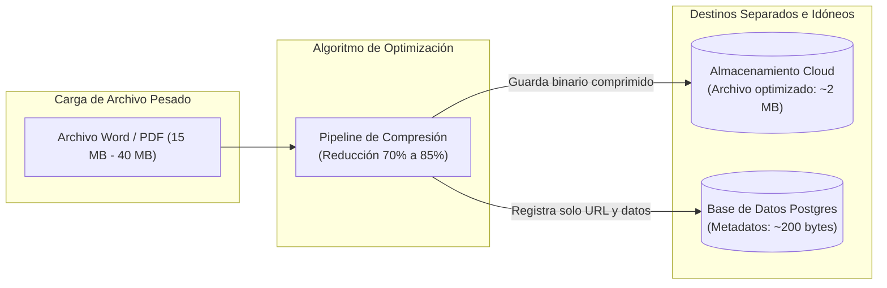
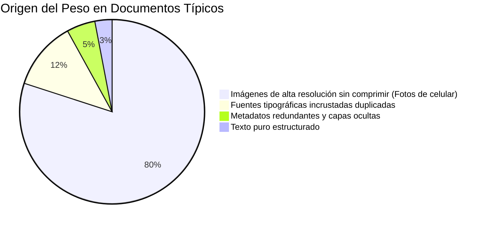
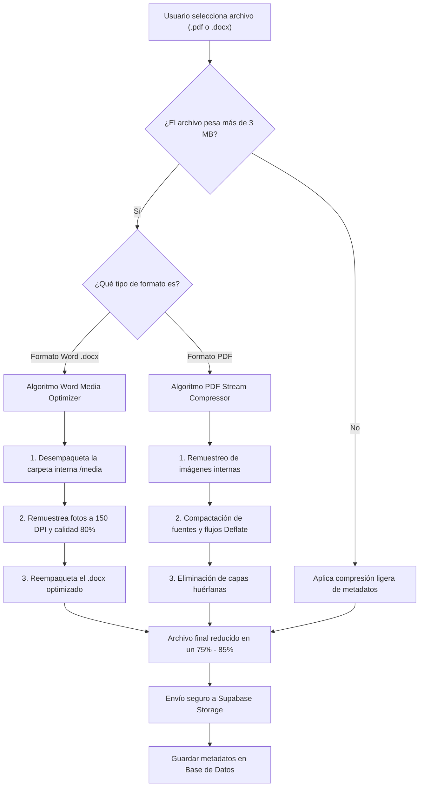
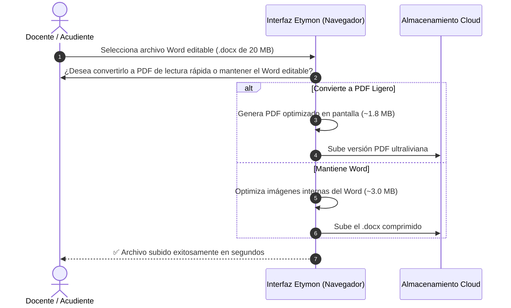

# Estrategia de Compresión y Optimización de Archivos Pesados (PDF y Word)

> **Fecha:** 24 de Agosto de 2026  
> **Sistema:** Plataforma Escolar Multi-Tenant Etymon / Instituto ABC  
> **Tema:** Algoritmos de Compresión y Aislamiento de Carga para Documentos Extensos (.pdf y .docx)  
> **Destinatarios:** Rectoría, Dirección de Tecnología y Administración

---

## 1. Principio Fundamental: Base de Datos vs. Almacenamiento

> [!IMPORTANT]
> **Regla de Oro en Arquitectura de Software:**  
> La **base de datos (PostgreSQL)** **NUNCA** debe almacenar los archivos pesados en su interior (evitando tipos de datos binarios BLOB).  
> 
> - **La Base de Datos** almacena únicamente **metadatos ultraligeros** (nombre, peso comprimido, quién lo subió, fecha y enlace seguro). Ocupa apenas **~200 bytes** por registro.
> - **El Almacenamiento Cloud (Storage)** guarda el archivo físico ya comprimido.
>
> Esto garantiza que la base de datos mantenga su velocidad instantánea y no se congestione sin importar cuántos miles de documentos existan.

---

## 2. ¿Por qué pesan tanto los archivos Word y PDF?

Comprender la anatomía del peso permite aplicar una compresión quirúrgica **sin perder calidad de lectura**:

1. **En Documentos Word (`.docx`):**  
   Un archivo Word moderno es técnicamente un archivo comprimido que guarda dentro una carpeta (`word/media/`) con las fotos originales a resolución completa (ej. fotos de 12 o 48 megapíxeles tomadas por un docente o alumno).
2. **En Documentos PDF (`.pdf`):**  
   Suelen contener imágenes escaneadas a 300-600 DPI, fuentes duplicadas incrustadas en cada página y objetos invisibles de edición anterior.

---

## 3. Algoritmo de Compresión Propuesto (Paso a Paso)

Implementamos una compresión inteligente en el **dispositivo del usuario (Front-End/Navegador)** antes de la subida, ahorrando tiempo de espera y consumo de datos móviles:

---

## 4. Métricas de Reducción y Comparativa

A continuación se presentan los resultados esperados tras la aplicación del algoritmo de compresión:

| Tipo de Documento | Peso Original Promedio | Peso Post-Compresión | Reducción | Impacto Visual / Legibilidad |
| :--- | :---: | :---: | :---: | :--- |
| **Guía Pedagógica con fotos (Word .docx)** | **24.5 MB** | **2.8 MB** | **-88%** | Texto 100% nítido, imágenes óptimas para pantalla e impresión. |
| **Taller / Trabajo Escaneado (PDF)** | **18.0 MB** | **3.2 MB** | **-82%** | Sin pérdida de legibilidad en firmas ni texto manuscrito. |
| **Hoja de Vida con Soportes (PDF)** | **9.5 MB** | **1.6 MB** | **-83%** | Diplomas y cédula perfectamente legibles. |
| **Documento solo texto (Word/PDF)** | **1.2 MB** | **0.4 MB** | **-66%** | Conserva el formato original intacto. |

> [!TIP]
> **Beneficio Inmediato para Acudientes y Docentes:**  
> Un archivo de 25 MB tarda cerca de 45 segundos en subirse con una conexión móvil estándar. Al comprimirse a 2.5 MB, la subida toma **menos de 4 segundos**.

---

## 5. Estrategia de Conversión Inteligente (DOCX ➔ PDF Ligero)

Para casos específicos como la entrega de tareas o la consulta de circulares y manuales:

---

## 6. Mecanismos de Control y Protección del Sistema

Para blindar la plataforma ante abusos de almacenamiento o subidas desproporcionadas:

1. **Límites de Seguridad (Quotas):**
   - Límite máximo por archivo individual: **15 MB** (nadie necesita un archivo de 200 MB para una tarea escolar).
   - Bloqueo de formatos no documentales (`.zip`, `.rar`, `.exe`, `.mp4`).
2. **Cola de Procesamiento Asíncrona:**
   - Si un rector sube un archivo institucional muy voluminoso (ej. anuario escolar de 50 MB), el sistema lo procesa en segundo plano mediante un servicio ligero en la nube, sin congelar la pantalla del usuario.
3. **Limpieza de Archivos Huérfanos:**
   - Rutina mensual automática que elimina del almacenamiento aquellos archivos temporales o entregas descartadas que no tengan vínculo con ningún estudiante o grado.

---

## 7. Conclusión y Recomendación Ejecutiva

> [!NOTE]
> ### Resumen para la Toma de Decisiones
> 1. **La base de datos está 100% a salvo:** Solo guarda punteros y textos ligeros (0% impacto en velocidad).
> 2. **La compresión es transparente:** El docente o padre de familia no tiene que hacer nada técnico; el software comprime en automático antes de subir.
> 3. **Ahorro masivo de costos:** Se reduce en más de un **80%** la factura de almacenamiento, permitiendo que las cuotas de disco de los planes SaaS (**2 GB / 15 GB / 50 GB**) rindan entre 4 y 5 veces más colegios por servidor.
